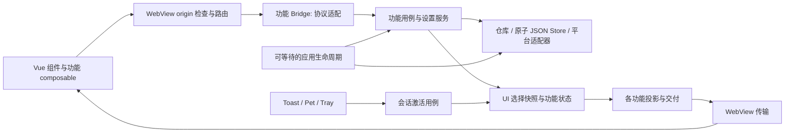

# SelfClaw Desktop 架构整改结果

实施日期：2026-09-13～2026-09-14。审查基线：`48ae6d89e99e73d175b11f2c06a64f576c4cee78`。开始时工作区仅有未跟踪的本 review 文档，没有已有源码修改；原始审查保留在文末，历史路径和行号不作为当前源码导航。

## 1. 交付与边界

**R01–R15 均已核对并实施。** 本次交付包含产品源码、正式行为回归、Vue 构建资源及文档。自动测试通过不代表原生桌面实机验收完成，具体限制见第 5 节。

- VM 保留 UI 线程上的选择、导航和提交快照；工作树准备/释放归 `ConversationWorkspaceService`，删除编排归 `ConversationDeletionService`。运行内容通过受锁保护的快照进入投影。
- 设置服务拥有已确认配置，JSON Store 只负责文件节点及原子替换；Agent 修改和变更信号归功能服务，Bridge 解释协议，Router 按明确的前缀/命令分派。
- `App` 在真正关闭前等待初始化、准入停止、回合/后台服务/资源收尾；DI 负责服务释放，窗口解除自身订阅并释放 WebView 视图。装配移到 `Composition/DesktopServiceRegistration`。
- 通知、Pet 和托盘共用会话激活用例；审批决定仍只有 `DesktopToolApprovalHandler` 一个所有者，展示由 `ToolApprovalPresenter` 适配。
- 通用 Channel/hostBridge 不再持有 transcript 状态。transcript 交付、CLI 发现、Pet 资源准备、Terminal 缓冲、Plugin 文件读取各自拥有其状态和成本边界。

Direct/CLI 共享事件、三种 committer、continuation 执行前 checkpoint、父终态与 delivery 原子提交、子任务隔离及 Plugin origin/CSP/权限/版本 lease 均保留。没有新增数据库 schema 或把 Desktop 平台接口搬入 Core。

文档复核还修正了“每个 Plugin 必定独占一个 renderer 进程”的表述：当前 [MainWindow](../SelfClaw.Desktop/MainWindow.xaml.cs) 使用默认 `EnsureCoreWebView2Async`，本轮没有显式进程隔离配置或进程分布实测证据。安全验证依赖 Router 的 origin 检查、Vue 的 origin/source 匹配和 CSP，不把 renderer 数量作为已验证保证。持有资源/状态行为的 `ConversationRuntimeState`、`SpriteSheet` 继续保留为有行为的类型，没有机械改成 DTO。

## 2. R01–R15 实施核对

| ID | 实施状态与当前代码 | 自动验证与剩余限制 |
| --- | --- | --- |
| R01 | **已实施。** [MainWindowViewModel](../SelfClaw.Desktop/ViewModels/MainWindowViewModel.cs) 移除破坏 UI 上下文的 await，增加刷新/选择版本检查；[GitWorkspaceBridge](../SelfClaw.Desktop/Services/Git/GitWorkspaceBridge.cs) 保持 UI 调用上下文。[工作目录服务](../SelfClaw.Desktop/Services/Workspace/ConversationWorkspaceService.cs) 承接准备/释放；[runtime state](../SelfClaw.Desktop/Services/Runtime/ConversationRuntimeState.cs) 统一锁定录制和快照读取，工具块与工具记录一起安装。 | [ShellStateTests](../SelfClaw.Tests/Desktop/ViewModels/ShellStateTests.cs) 用延迟 I/O 和 STA Dispatcher 检查通知线程、旧刷新不覆盖新选择、切换根目录不清空新选择；既有 recorder/session/continuation 回归通过。真实窗口与混合 DPI 未实测。 |
| R02 | **已实施。** [DesktopSettingsJsonStore](../SelfClaw.Desktop/Services/Settings/DesktopSettingsJsonStore.cs) 写同目录临时文件、flush 后替换；缺失文件与不可读/损坏 JSON 分开。Appearance、CLI、composer 采用落盘后提交缓存；取消或写入失败保留已确认值。 | [DesktopSettingsTests](../SelfClaw.Tests/Desktop/Services/Settings/DesktopSettingsTests.cs) 覆盖节点序列化后的取消窗口、替换被锁、损坏/非对象 JSON、多节点并发保存、主题及 CLI 缓存一致性。未模拟断电或真实磁盘硬件故障。 |
| R03 | **已实施；原生退出待验收。** [App](../SelfClaw.Desktop/App.xaml.cs) 使用显式关闭与共享 shutdown Task；初始化等待和服务关闭各有 20 秒预算。MainWindow/VM 初始化可合并等待；[engine](../SelfClaw.Desktop/Services/Runtime/ConversationTurnEngine.cs) 停止准入，[coordinator](../SelfClaw.Desktop/Services/Runtime/ConversationSessionCoordinator.cs) 取消并等到终态/释放完成。Router 等在途请求，Pet flush 待保存位置，Terminal/Plugin 在 Dispatcher 存活时收尾。`OnExit` 仅同步兜底。 | `ShellStateTests.Initialization_is_shared_and_failure_can_be_retried`、`ConversationSessionCoordinatorTests.Shutdown_cancels_then_waits_for_terminal_state_and_release` 通过。尚未启动真实 Desktop 在生成、审批、continuation、ConPTY 期间退出；超时不承诺完成未结束工作。 |
| R04 | **已实施。** [AgentSettingsService](../SelfClaw.Desktop/Services/Agents/AgentSettingsService.cs) 提交后发信号，VM 自己更新定义缓存；[Agent 选择](../SelfClaw.Desktop/ViewModels/MainWindowViewModel.Agents.cs) 保留会话绑定/当前 id。已删除定义显示不可用，并在发送前明确拒绝，避免悄悄使用 build。 | `ShellStateTests.Agent_refresh_preserves_display_context_and_runtime_and_deleted_definitions_fail_explicitly` 同时核对选择、Plugin context 和真实 engine 收到的 runtime request。 |
| R05 | **已实施；Toast 实机待验收。** [DesktopConversationActivationService](../SelfClaw.Desktop/Services/Windowing/DesktopConversationActivationService.cs) 统一窗口恢复和会话导航，并把 child 通知导航到 Interactive parent。[通知适配器](../SelfClaw.Desktop/Services/Notifications/DesktopNotificationActivationService.cs) 消费 `openConversation`；[ToolApprovalPresenter](../SelfClaw.Desktop/Services/Tools/ToolApprovalPresenter.cs) 统一重放和带会话上下文的审批状态。 | 通知编码→解析→VM 导航及删除目标的正式测试通过；既有批准/拒绝/超时/订阅失败回归通过。测试没有实际发送或点击 Windows Toast。 |
| R06 | **已实施。** Router 为持久化/导航操作返回关联结果及错误码；[useConversationNavigation](../SelfClaw.TranscriptVue/src/composables/useConversationNavigation.js) 等待执行结果并显示失败，外观保存失败回滚到确认值，Pet 错误进入模板。WebView 初始化及命令异常进入 `ILogger`。 | `WebViewMessageRouterTests.Conversation_command_failures_are_correlated_instead_of_reporting_success` 覆盖非法参数和业务拒绝；[programmingSelection.test.js](../SelfClaw.TranscriptVue/tests/programmingSelection.test.js) 从实际控件触发保存失败，验证错误可见且选中值回滚。文件 picker 的取消回归保留；真实原生弹框未实测。 |
| R07 | **已实施。** [useProgrammingAssistantSelection](../SelfClaw.TranscriptVue/src/composables/useProgrammingAssistantSelection.js) 由设置页与 composer 共用；保存排队、宿主确认后更新、revision/请求代次防止旧读取覆盖。未选中的 CLI 限制编辑模型。Direct 模型 id 随 prompt 提交，移除 Bridge→VM 的重复模型缓存和读取副作用。 | 同时挂载设置页与 ModelSelector，覆盖已存模型/推理恢复、修改、失败回滚、重新进入设置、旧读失败晚到；后端测试核对 `GetSelectedInvocationAsync` 的已确认值。 |
| R08 | **已实施。** [AgentSettingsBridge](../SelfClaw.Desktop/Services/Agents/AgentSettingsBridge.cs) 仅解析输入、调用服务和包装输出；CRUD、绑定规则、视图和提交后通知在 Agent 功能服务内。[Router](../SelfClaw.Desktop/Services/WebView/WebViewMessageRouter.cs) 显式区分 `plugin-host/api` 与其他前缀，不再依赖尝试顺序同步 VM 缓存。 | `AgentSettingsBridgeTests.Concurrent_bindings_after_delayed_catalog_reads_preserve_both_committed_changes` 用同一服务并发修改，重读文件确认 Skill/MCP 两项都保留。协议路由、origin、相关错误回包回归通过。 |
| R09 | **已实施。** [ProgrammingCliDiscovery](../SelfClaw.Desktop/Services/ProgrammingAssistant/ProgrammingCliDiscovery.cs) 和 [CliProbeProcess](../SelfClaw.Desktop/Services/ProgrammingAssistant/CliProbeProcess.cs) 从设置服务分离；三个 CLI 可并行发现，首屏只读取配置，后台扫描不持有设置锁。每路保留最多 262,144 个 UTF-16 字符并继续排空，检查 exit code，取消/超时终止并等待进程树。 | [CliProbeProcessTests](../SelfClaw.Tests/Desktop/Services/ProgrammingAssistant/CliProbeProcessTests.cs) 运行真实无界面 PowerShell 子进程及其 child，验证 0/7 退出码、双路超量输出、取消、超时及 PID 不再存活；[并发测试](../SelfClaw.Tests/Desktop/Services/ProgrammingAssistant/ProgrammingAssistantConcurrencyTests.cs) 验证慢扫描不阻塞读取/保存，也不覆盖扫描期间的新选择。不是对三种真实 CLI 安装环境的完整验收。 |
| R10 | **已实施。** [TranscriptDelivery](../SelfClaw.Desktop/Services/Transcript/TranscriptDelivery.cs) 拥有 diff、baseRevision、单个在途/最新状态、2 秒间隔且最多三次完整重试及显式恢复；[transcriptBridge](../SelfClaw.TranscriptVue/src/composables/transcriptBridge.js) 拥有 reducer/关键消费者确认。通用订阅者异常隔离，关键渲染错误拒绝确认；Plugin context 直接观察 Shell 状态。旧 `transcript-rendered` 协议删除。 | [hostTranscript.test.js](../SelfClaw.TranscriptVue/tests/hostTranscript.test.js) 覆盖订阅异常、错误基线、渲染失败、恢复和重新订阅；交付测试覆盖漏/晚 ACK、重试上限、最新快照及导航重放。`transcript-applied` 表示关键状态消费者完成 Vue 更新及下一帧调度，不承诺屏外异步内容或像素级绘制完成。 |
| R11 | **已实施。** [TranscriptProjection](../SelfClaw.Desktop/Services/Transcript/TranscriptProjection.cs) 每轮建一次 message-id→tools 索引，按不可变记录引用复用消息投影，导航失效与正文分开，缓存只保留当前输入。附件检查退出缓存命中路径。[Plugin transcript 投影](../SelfClaw.TranscriptVue/src/renderers/pluginTranscript.js) 复用普通对象，每 500 ms 合并一次，完整恢复窗口最多 256 KiB UTF-8，显式携带 `totalItems/truncated`。 | [性能回归](../SelfClaw.Tests/Desktop/Services/Transcript/TranscriptProjectionPerformanceTests.cs) 同时核对未变 item 身份、最新正文和分配增长；数字见第 3 节。Plugin 序列化预算和投影复用有正式测试；多个真实 iframe 的 UI 耗时未测量。 |
| R12 | **已实施。** [PetHost](../SelfClaw.Desktop/Pet/Hosting/PetHost.cs) 统一配置/实际包/可见性/加载结果；Catalog 后台准备并冻结位图，adapter 只安装资源与操作窗口，VM 不再吞加载异常。内置包元数据按进程生命周期缓存，设置 Bridge 推送 Host 变更。 | [PetHostTests](../SelfClaw.Tests/Desktop/Pet/PetHostTests.cs) 覆盖损坏、回退、重试、隐藏时选择、保存失败和配置一致性；延迟 decoder 时 Dispatcher 仍可执行，真实 PetViewModel 能安装冻结帧。没有打开真实 PetWindow 验证 DPI、拖拽和大型资源的实际帧率。 |
| R13 | **已实施；ConPTY 实机待验收。** [TerminalOutputReader](../SelfClaw.Desktop/Services/Terminal/TerminalOutputReader.cs) 按连续流解码；[buffer](../SelfClaw.Desktop/Services/Terminal/TerminalOutputBuffer.cs) 保留最多 262,144 字符尾部，33 ms 定时批量发送，每批最多 32,768 字符。隐藏/未就绪保留有界尾部，超量明确提示；输入异步并限制在途数量，释放等待 native reader。 | [TerminalOutputTests](../SelfClaw.Tests/Desktop/Services/Terminal/TerminalOutputTests.cs) 逐字节提供中文/emoji，检查完整文本、超量上限和旧 session 隔离；controller 生命周期回归通过。未运行真实 ConPTY、终端高吞吐或原生退出场景。 |
| R14 | **已实施；WebView 资源回调实机待验收。** [PluginPanelHostController](../SelfClaw.Desktop/Services/Plugins/PluginPanelHostController.cs) 用单一异步修改门串行打开，最多 8 个面板；关闭/导航/禁用使在途代次失效，未移交 lease 在 finally 释放。资源由 [PluginPanelResourceReader](../SelfClaw.Desktop/Services/Plugins/PluginPanelResourceReader.cs) 准备，经 deferral 回 UI 提交；最多 4 个并发读取、每份 8 MiB，读取另持版本 lease。CSP/origin/权限及工作根约束保留。 | [PluginPanelConcurrencyTests](../SelfClaw.Tests/Desktop/Services/Plugins/PluginPanelConcurrencyTests.cs) 覆盖双打开、关闭/Dispose 期间获取、最后关闭可 drain、锁文件/缺失/超限 HTTP 结果；Vue 测试覆盖在途合并、失效响应、active tab 恢复和来源校验。这里采用有界串行门替代额外的逐 Plugin 任务注册表，以减少状态；同 Plugin 获取次数为一次的测试提供证据。 |
| R15 | **已实施。** Definitions/Models/Views、Notifications、Settings、SystemTray、Transcript.Views、Pet.Settings 目录及命名空间归属一致。删除 `ShellSelectOption`、未用名称解析/HasRow、空通知 IDisposable、旧 settings 协议、CLI 无锁读取面和备用 Pet 构造路径；主题解释归服务，标签 activeKey 真正恢复。同步本文、AGENTS、运行流程及设计文档入口。 | 目录迁移独立回归 **316/0/4**；最终全方案构建及全量测试见第 4 节。仓库源码检索确认旧类型/协议无消费者；参数化 PetWindow XAML 构建通过，但未做设计器预览验收。 |

## 3. 成本验证

最终 Debug 产物的合法合成数据，每条 assistant 消息含一个 ToolCall 和 Text 段，每条一个工具记录；预热后只改最后一条消息，五轮取中位数，输入构造不计入测量：

| 消息 / 工具数 | 原审查 Build | 最终 Build | 最终线程分配 |
| --- | ---: | ---: | ---: |
| 500 / 500 | 5.13 ms | 0.42 ms | 222,176 bytes |
| 2,500 / 2,500 | 103.34 ms | 2.80 ms | 1,020,648 bytes |

不同运行时机的耗时仅作趋势参考；正式断言检查分配增长及用户可见内容，不设脆弱的毫秒阈值。没有把这些数值当作真实 provider 延迟或 WebView 帧率。当前会话历史仍需线性访问并占用内存；本次未引入虚拟化。

Plugin `transcript` 事件是有界完整窗口：从最近消息向前填充，超出窗口时 `truncated=true`，单条超限使用明确占位。新面板握手用同一窗口恢复。它不承诺每次广播全部历史；预算按完整事件的 UTF-8 序列化表示验证。

## 4. 验证记录

| 批次/产物 | 通过 / 失败 / 跳过 |
| --- | --- |
| R01–R03：phase1-state-fixed.trx | 44 / 0 / 0 |
| R04–R08、R10：phase2-desktop-fixed.trx | 299 / 0 / 4 |
| R09、R11–R14：phase3-desktop.trx | 315 / 0 / 4 |
| 行为清理：cleanup-behavior.trx | 24 / 0 / 0 |
| R15 目录迁移：phase4-layout.trx | 316 / 0 / 4 |
| **最终全量：full-dotnet-final-complete.trx** | **821 / 0 / 4，共 825** |
| **Vue `npm test`** | **9 文件、32 测试通过** |
| **Edge Playwright** | **11 通过，0 失败，0 flaky；退出码 0** |
| Vue production build、全方案 build | 成功；.NET **0 错误、3 个 NU1900 环境警告** |

TRX 位于 `TestResults/desktop-remediation/`，Playwright JSON 位于 `SelfClaw.TranscriptVue/test-results/results.json`，均为本地忽略产物。阶段数不能相加。Vue 已重新构建到 `Desktop/Assets/TranscriptVue`，独立 Desktop 输出也已同步资源。

实施中的失败没有用重跑掩盖：第一批捕获了“给已提交终态重新添加工具位置”的新增回归，已把 streamed tool 更新与持久化终态载入分开；两项新测试的清理错误来自 SQLite 连接池，改为关闭本测试数据库的池。第二批按新协议修正模型缓存事件测试，并修正 context 首次 ready 的多余推送。Pet host 测试改为真正准备资源后，补全了合法的小型 manifest；后续全部通过。原失败 TRX 保留。

最后复核补上 composer 模式初始化/并发保存的同一串行提交门，相应磁盘与显示值回归通过。`full-dotnet-final-verified.trx` 随后记录了一项 CLI 探针夹具失败：`File.Exists(pids.txt)` 成立时，子进程的 `WriteAllText` 尚未关闭文件，读取触发占用异常。已改为写完 `pids.tmp` 后原子移动发布就绪文件，保持原超时、等待条件和父子 PID 退出断言；`cli-probe-ready.trx` 四项通过，最终全量 821 项通过。

原 review 提到的两项 Activity 时序失败在本轮阶段和最终全量中**均未复现**。保留原断言和等待策略，没有增加固定等待；`ActivityPanelBridgeTests`、`ActivityPanelLifecycleTests` 现将完整消息序列写入测试输出/TRX，后续失败可以按 request id、revision、selection id 追踪，未凭通过结果宣称查明原失败根因。

首次默认 Playwright 命令的 11 个用例均报告通过，但托管 dev server 的收尾没有结束，未把该次命令标成整体通过；中断后该执行会话已失效，首轮服务器回收未确认。后续增加可选 `SELFCLAW_E2E_BASE_URL`，用单独启动且由当前执行会话关闭的 Vite 服务器跑相同用例，完整退出并生成 JSON 报告。默认服务器收尾在此环境中的具体根因未确认。

可复核命令（PowerShell，仓库根）：

```powershell
$env:DOTNET_CLI_HOME = 'D:\Repositories\SelfClaw\.dotnet'
$env:DOTNET_SKIP_FIRST_TIME_EXPERIENCE = '1'
$env:DOTNET_NOLOGO = '1'
dotnet restore SelfClaw.slnx --force-evaluate --ignore-failed-sources
dotnet build SelfClaw.slnx --no-restore -p:BaseOutputPath=bin/desktop-remediation-final/
dotnet test SelfClaw.Tests/SelfClaw.Tests.csproj --no-build --no-restore -p:BaseOutputPath=bin/desktop-remediation-final/ --logger 'trx;LogFileName=full-dotnet-final-complete.trx' --results-directory TestResults/desktop-remediation
```

Vue 目录执行 `npm test`、`npm run build`。端到端最终复核时，先在一个会话运行 `node node_modules/vite/bin/vite.js --host 127.0.0.1 --port 5183 --strictPort`，另一个会话设置 `$env:SELFCLAW_E2E_BASE_URL='http://127.0.0.1:5183'` 后执行 `npm run test:e2e`，完成后关闭该测试服务器。

## 5. 剩余验证限制

1. 未启动实际 WPF 主窗口验证 Toast 点击/原生文件弹框、混合 DPI、Pet 拖拽、ConPTY、生成/审批/continuation 期间退出。STA Dispatcher、冻结位图、真实 CLI 子进程和浏览器端测试不能替代这些检查。
2. 四项 smoke 按既有开关跳过：真实 WebView2、进程恢复的两个测试入口、真实 provider reasoning。没有开启 `SELFCLAW_DESKTOP_SMOKE=1` 或 `SELFCLAW_PROVIDER_SMOKE=1`，也没有调用真实 provider。
3. 关闭预算用尽会记录未完成状态并退出，不能承诺已失去响应的原生组件完成收尾；断电/强杀依赖既有持久化恢复，continuation checkpoint 仍只表示可能执行，不承诺外部副作用 exactly-once。
4. 内置 Pet 元数据缓存按进程生命周期刷新；Plugin 广播与资源字节预算已经验证，多 iframe 的实际 CPU/渲染成本及 WebView deferral 释放仍需实机测量。
5. 依赖还原成功，但在线 NuGet 漏洞数据源不可达，出现 NU1900；本次没有宣称在线依赖审计通过。默认 Playwright dev-server 收尾问题保留为测试环境限制，外部服务器方式已完整通过。

---

<details>
<summary>2026-09-13 原始审查（历史基线、原始证据与当时路径）</summary>


# SelfClaw Desktop 架构与可维护性审查

审查日期：2026-09-13。源码基线：`48ae6d89e99e73d175b11f2c06a64f576c4cee78`。

本次交付为 review 文档，未修改产品源码。审查开始时工作区干净。隔离探针及其临时数据位于 `.scratch/desktop-architecture-review/`；关键条件和结果已写入本文，文档的结论不依赖这些被 Git 忽略的文件。

## 1. 结论与范围

Desktop 已经有值得保留的功能边界：回合执行、内容录制、transcript 投影、Activity Panel、Pet 行为状态机均有独立实现。目前最影响维护的是**状态所有权、UI 线程约束、操作结果契约和资源生命周期没有贯穿这些边界**。同一个用户操作经常跨越 Vue 本地状态、Bridge、ViewModel、文件存储和窗口对象，各层对“已经成功”“当前选中”“已经结束”的判断不一致。

优先修复 UI 状态越线程修改、设置文件写入和退出生命周期，再收敛通知/审批/设置的结果与状态传播。保留现有功能目录，逐步把业务修改放回功能服务、把传输放回通信层，能够直接降低维护成本。新增抽象应有明确的状态或资源所有权。

范围以 **整个 `SelfClaw.Desktop` 的架构代码**为中心，包含：

| 范围 | 本次核对内容 |
| --- | --- |
| `App`、`MainWindow`、Windowing | DI 装配、初始化、退出、WebView 创建与销毁、窗口命令、异常弹框 |
| Notifications、Tools、AgentActivity、SystemTray | Toast、通知激活、审批队列、审批展示、Pet/主窗口激活、托盘操作 |
| `ViewModels`、Workspace、Git | 选择状态、工作目录准备、会话导航/删除、异步线程、前端操作入口 |
| Settings 相关功能 | Appearance、ProgrammingAssistant、AI Providers、Agents、Extensions、Pet、共享 JSON 存储 |
| Pet | Hosting、Catalog、Behavior、Presentation、ViewModel、窗口和精灵渲染 |
| WebView、Transcript、Activities、Plugins、Terminal | 协议、状态发布、ACK、重放、资源租约、输出管线及模块依赖 |
| Runtime、Subagents | 与 UI、生命周期、通知和快照的边界；保留刚完成的 Direct/continuation 重构成果 |
| Vue 对应调用方 | `hostBridge`、设置页、composer 选择器、应用壳、插件通信；核对桌面契约是否真正被消费 |

目录盘点覆盖 170 个 Desktop C# 源文件、19,684 行；重点逐文件追踪上述调用链。行数用于定位复杂度热区，问题判定以调用关系、状态变化和失败路径为依据。例如 `MainWindowViewModel` 主文件 872 行、Agents partial 61 行；Router 452 行、17 个构造参数；`MainWindow` 674 行；CLI 设置服务 637 行。

不把本次 review 当作全功能验收。未实际启动主应用验证 Toast、原生文件弹框、混合 DPI、ConPTY 或退出时的进程行为；对应发现注明为源码结论或待实机验证。Direct provider、MCP、SQLite 内部算法的完整复审见已有 [Direct 审查与整改](direct-agent-architecture-review.md)。

## 2. 问题总表

优先级：**P1** 应先于下一轮功能扩展修复；**P2** 应进入近期架构整理；**P3** 随相关模块修改清理。证据“已复现”指调用当前源码构建产物或执行当前前端逻辑的隔离探针，具体限制见第 7 节。

| ID | 优先级 | 问题 | 证据 |
| --- | --- | --- | --- |
| R01 | P1 | ViewModel 的 UI 状态在后台线程更新，通信模块对线程的假设相互冲突 | 已复现 |
| R02 | P1 | 共享设置文件覆盖写入；写入失败后内存缓存仍可能报告新值 | 已复现 |
| R03 | P1 | 初始化和退出缺少可等待的生命周期边界 | 源码；退出需进程级验证 |
| R04 | P2 | Agent 缓存刷新重置选择，显示代理与会话实际执行代理可能分离 | 已复现重置 |
| R05 | P2 | 通知“打开会话”动作没有消费方；窗口激活和审批展示分散 | 源码 |
| R06 | P2 | 业务操作混用请求/即发即忘，失败没有稳定的用户反馈路径 | 源码 |
| R07 | P2 | CLI 设置页与 composer 各自管理选择；设置页控件未保存且不恢复已存值 | 已复现 |
| R08 | P2 | Router/Bridge 同时承担路由、业务修改、投影和缓存同步，原子修改边界被切开 | 源码交错分析 |
| R09 | P2 | CLI 设置服务兼任发现器和进程宿主，取消遗留子进程，扫描阻塞初始化/读取 | 已复现取消问题 |
| R10 | P2 | 通用通信层与 transcript 强耦合，订阅异常可以永久阻断 ACK 管线 | 前端已复现；宿主状态机源码确认 |
| R11 | P2 | transcript 每次刷新重复遍历全历史，缓存命中仍有明显成本 | 合成测量 |
| R12 | P2 | Pet 的配置、实际加载结果、可见性没有形成一致状态；加载 I/O 在 UI 线程 | 源码 |
| R13 | P2 | Terminal 按字节块解码 UTF-8，输出无限排入 Dispatcher，缺少明确的流边界 | 源码 |
| R14 | P2 | Plugin 宿主同时拥有请求、租约、文件服务、持久化，异步移交和 I/O 边界不完整 | 源码；并发/实机待验证 |
| R15 | P3 | 功能目录与类型归属不一致，残留协议、死类型和无效封装增加阅读负担 | 仓库引用核对 |

## 3. 需要优先修复的状态与生命周期问题

### R01 — UI 状态所有权与异步线程约束冲突

**位置**：[MainWindowViewModel](../SelfClaw.Desktop/ViewModels/MainWindowViewModel.cs) L487–506、L629–658；[GitWorkspaceBridge](../SelfClaw.Desktop/Services/Git/GitWorkspaceBridge.cs) L59–79；[ActivityPanelPublisher](../SelfClaw.Desktop/Services/Activities/ActivityPanelPublisher.cs) L195–201；[MainWindow](../SelfClaw.Desktop/MainWindow.xaml.cs) L361–366。

`ReloadWorkspaceRootsAsync()` 在 Git 查询和仓库读取后使用 `ConfigureAwait(false)`，随即替换 `_workspaceRoots`、更新选中根目录并触发 `PropertyChanged`。Managed Worktree 的 `SendAsync()` 也在离开 UI 上下文后修改选择和应用准入结果。`GitWorkspaceBridge` 在后台续体中调用选择控制器，使问题不只存在于 VM 内部的一个 `await`。

消费方却假定这是 UI 事件：`ActivityPanelPublisher.OnSourceChanged()` 直接 `Dispatcher.VerifyAccess()`；主窗口的属性回调会更新 Terminal，并最终调用 WebView。`TranscriptPublisher` 只把自己的发布调回 UI，不能保护此前的集合修改和事件回调。

隔离探针在真实 VM 中注入延迟 Git 查询：UI 线程 id 为 9，属性通知在线程 6 发出，Dispatcher 断言抛出“调用线程无法访问此对象”。探针没有创建实际窗口，但断言与当前 Activity publisher 的约束一致。

**影响**：刷新工作目录、切换分支、准备工作树可产生跨线程错误。失败发生在工作树准备期间时，还会进入 VM 的准备失败/清理路径。运行内容的可变集合也不适合一边后台修改、一边由 UI 投影读取；[ConversationRuntimeState](../SelfClaw.Desktop/Services/Runtime/ConversationRuntimeState.cs) L36–45 的 getter 会物化内容并返回内部集合。

**建议**：明确 VM 的选择和导航状态只由 UI 线程修改；Git/文件/数据库服务返回结果后，在一个 UI 提交点安装快照。移除 ViewModel 中破坏这一约定的 `ConfigureAwait(false)`，同时修正 Bridge 从后台调用 VM 的路径。后台 continuation 通过快照进入选中会话显示层。工作树准备/释放放回 Workspace 功能服务，VM 保留选择捕获和用例调用。

**验收**：延迟所有外部 I/O，覆盖刷新工作目录、分支切换、创建工作树、并发导航；检查所有选择属性通知均在 Dispatcher，旧选择结果不覆盖新选择，真实 Activity/Terminal 订阅者不会抛错。

### R02 — 设置写入缺少原子性，缓存提交时机不一致

**位置**：[DesktopSettingsJsonStore](../SelfClaw.Desktop/Services/DesktopSettingsJsonStore.cs) L43–89；[AppearanceSettingsService](../SelfClaw.Desktop/Services/Appearance/AppearanceSettingsService.cs) L55–69；[ProgrammingAssistantSettingsService](../SelfClaw.Desktop/Services/ProgrammingAssistant/ProgrammingAssistantSettingsService.cs) L196–203、L216–244。

共享文件通过 `File.Create()` 先截断，再异步序列化。读取时把 I/O 异常、权限错误和无效 JSON 全部当作空配置；后续保存会基于这个“空配置”覆盖文件。一次 Pet、主题或标签页写入失败，影响范围可以扩展到同文件中的其他功能节点。

已复现两种情况：

- 在值已序列化成节点、准备写磁盘时触发取消：原 322 字节文件变成 **0 字节**；随后保存 Pet 后，文件只剩 `pet` 节点。
- 锁定设置文件后保存深色主题：方法抛 `IOException`，同一服务再读取为 `dark`，新建服务从磁盘读取仍为 `light`。原因是 `_cached` 在持久化成功之前被替换。CLI 设置的多个写入入口采用同样顺序。

**建议**：JSON Store 负责同目录临时文件写完再原子替换，读取失败与文件不存在分别处理；读取异常保留原文件及诊断，避免下一次写入悄悄清空其他节点。各功能服务统一采用“计算 next → 持久化成功 → 更新内存 → 发出变更”的顺序。Agent 定义服务已有临时文件＋`File.Replace` 实现，可复用这项具体策略，无需引入通用事务框架。

**验收**：取消、磁盘写入失败、文件被锁、无效 JSON、多功能并发保存；旧文件或完整新文件至少有一份可恢复，其他节点不丢失，保存失败后读取的配置保持旧值。

### R03 — 生命周期清理发生得过晚，初始化也不可合并等待

**位置**：[App](../SelfClaw.Desktop/App.xaml.cs) L65、L218–232、L242–272；[MainWindow](../SelfClaw.Desktop/MainWindow.xaml.cs) L121–140；[ConversationSessionCoordinator](../SelfClaw.Desktop/Services/Runtime/ConversationSessionCoordinator.cs) L222–244；[MainWindowViewModel](../SelfClaw.Desktop/ViewModels/MainWindowViewModel.cs) L119–134。

应用使用 `ShutdownMode.OnMainWindowClose`，但 `StopAsync()` 和异步 DI 释放放在 `async void OnExit()`。WPF 的退出回调不能等待其返回的异步任务；遇到未完成的 await，后续清理不再处于可靠的应用存活/Dispatcher 边界内。主窗口已经在 `Closed` 中释放 Terminal 和 Plugin controller，DI 随后又负责这些单例的释放，所有权也有重叠。

交互回合在 VM 中脱离调用者执行；Session coordinator 的 `Dispose()` 对仍运行的回合执行取消后立即释放状态，没有等待 `Completion`。这与 Subagent background host 已经等待执行任务的设计不一致。

初始化的另一端是 `_initialized = true` 先于第一次读取。第二个调用者直接返回，不能等待第一个初始化；第一次失败后该标记仍为 true。通知激活与窗口 Loaded 都会调用此入口。

**影响**：正常关闭仍可能截断终态持久化/资源释放；迟到回调可能访问已释放的状态。初始化失败也难以重试。这里是生命周期源码风险，尚未用实际关闭 WPF 进程测量丢失范围。

**建议**：建立单一、可等待且有超时的关闭入口，在真正 `Close/Shutdown` 前停止接收新操作，取消并等待交互回合和后台任务，完成必要持久化，再释放 UI 资源。`OnExit` 保留同步兜底。DI 负责服务资源，窗口只解除自身订阅和视图绑定。初始化用可共享的进行中 Task 表达就绪状态，失败策略显式化。

**验收**：实际进程中覆盖生成、审批、Pet 位置保存、Terminal 和 continuation 运行期间退出；确认正常退出能完成约定的终态记录，超时有日志，Dispatcher 停止后不再等待 UI 清理。并发初始化应共享完成结果。

## 4. 通知、弹框、设置与 Vue 通信

### R04 — 刷新 Agent 定义悄悄改变当前选择

**位置**：[MainWindowViewModel.Agents](../SelfClaw.Desktop/ViewModels/MainWindowViewModel.Agents.cs) L10–15；[AgentSettingsBridge](../SelfClaw.Desktop/Services/Agents/AgentSettingsBridge.cs) L360–363；[WebViewMessageRouter](../SelfClaw.Desktop/Services/WebView/WebViewMessageRouter.cs) L410–418；[MainWindowViewModel](../SelfClaw.Desktop/ViewModels/MainWindowViewModel.cs) L599、L820–851。

所有 Agent/Subagent 修改均触发 `AgentsChanged`，Router 随即执行 `ReloadAgents()`；该方法固定 `SelectAgentCore(null)`，最终回退到 `build`。隔离探针确认 `review-agent → ReloadAgents → build`。

若当前是自定义 Agent A 的既有会话，刷新后 `_selectedConversation` 仍绑定 A，发送时也使用 `conversation.AgentId`；composer、Plugin context 和导航投影却读取被重置的 `_selectedAgentId`。用户在修改另一个 Subagent 时也能触发这一状态分裂。

**建议**：定义缓存刷新与用户选择分开。刷新保留合法的当前 id；选中会话时，明确由会话绑定决定显示和执行代理。删除当前定义时显式处理关联会话，避免默认回退掩盖失效状态。定义服务在提交后发出变更，Router 不再充当缓存同步的所有者。

**验收**：选择 A 并打开 A 会话，修改 B、绑定扩展、保存 Subagent；显示、导航、Plugin context 和下一轮 runtime request 均继续使用 A。

### R05 — 通知动作断链，激活和审批展示缺少明确归属

**位置**：[DesktopNotificationService](../SelfClaw.Desktop/Services/DesktopNotificationService.cs) L22–49、L53–91；[DesktopNotificationActivationService](../SelfClaw.Desktop/Services/DesktopNotificationActivationService.cs) L40–81；[MainWindow](../SelfClaw.Desktop/MainWindow.xaml.cs) L435–570；[SystemTrayService](../SelfClaw.Desktop/Services/SystemTrayService.cs) L139–166。

完成通知和 Subagent continuation 失败通知均生成 `openConversation` 与 `conversationId`，激活服务却仅处理审批动作和 `openApp`，把 `openConversation` 记录为 unsupported。点击“Open”只唤起窗口，不能选择目标会话。现有通知测试只验证参数编码/解码，没有覆盖消费动作。

Pet 的打开会话又在 `MainWindow` 中实现了另一套“选择会话＋显示＋恢复＋激活”；Toast 借道 `SystemTrayService` 激活窗口。托盘因此承担了其他入口的窗口导航服务职责。审批方面，MainWindow 同时负责通知文案、Toast 触发、当前审批 id、Vue 回包和重放；审批队列本身则在 handler/coordinator 中，维护者要跨多处才能理解一次审批展示。

**建议**：提供一个桌面会话激活用例，由 Toast、Pet、托盘共同调用；它明确接收可选 conversation id，并统一处理已删除会话。审批决定继续归 `DesktopToolApprovalHandler`，审批展示集中到独立的 presenter/bridge，窗口只执行原生显示动作。全局 FIFO 审批与当前会话的关系需要在展示契约中体现：当前 [AgentActivityCoordinator](../SelfClaw.Desktop/Services/AgentActivity/AgentActivityCoordinator.cs) L334–349 优先取全局首个审批，而 Vue 审批消息未携带会话标识。

**验收**：动作从通知编码一直运行到正确会话被选中；已删除会话有明确结果；审批成功、拒绝、超时和 WebView 重载只有一份 pending 状态。

### R06 — 业务失败缺少一致的回包、日志与可见反馈

**位置**：[WebViewMessageRouter](../SelfClaw.Desktop/Services/WebView/WebViewMessageRouter.cs) L276–348；[MainWindow](../SelfClaw.Desktop/MainWindow.xaml.cs) L369–386；[Vue App](../SelfClaw.TranscriptVue/src/App.vue) L316–328；[Pet 设置页](../SelfClaw.TranscriptVue/src/components/settings/Pet.vue) L64–85、L89–134；[useAppearance](../SelfClaw.TranscriptVue/src/composables/useAppearance.js) L149–165。

`send-prompt` 已经有可关联的接受/拒绝结果，但删除会话等操作仍由 Vue `post()` 发出，Router 直接等待 VM。工作树未合并、子任务停止超时等异常最后只进入 `Debug.WriteLine`，没有回复给触发操作的界面。前端显示确认框并不能替代后端操作结果。

Pet 页收到失败会设置 `syncError`，模板没有显示它；外观保存通过不带 request id 的 `post`，也没有消费保存结果。用户会看到“没反应”或只在本次会话生效的修改。`EnsureTranscriptHostAsync()` 的总 catch 同样只切换 fallback，未记录真实失败原因。

**建议**：会改变持久状态或可能被拒绝的操作使用关联请求，统一最小结果字段与错误码，功能 composable 负责 pending、失败展示和必要回滚。窗口拖拽等高频即时命令继续使用 `post`。后台错误进入 `ILogger`；反馈选择 inline/toast/native dialog 应有固定职责，不需要把全部提示塞进一个泛型弹框框架。

当前消息/弹框的职责建议如下：

| 类别 | 当前分布 | 建议归属 |
| --- | --- | --- |
| 启动失败、不可恢复 UI 异常 | `App` 原生 `MessageBox` | 应用生命周期错误入口，保留启动兜底 |
| 设置保存/会话命令失败 | 各 Bridge、VM、Vue 页，部分失败无人消费 | 关联 response + 功能 composable + 现有 Toast/inline 组件 |
| 工具审批决定 | handler、Activity coordinator、MainWindow、Pet、Toast | handler 唯一决定；展示层共享当前请求和上下文 |
| 打开窗口/会话 | Tray、通知激活、MainWindow Pet 回调 | 单一激活用例，入口只解析意图 |
| 文件/目录选择 | `IWorkspaceFolderPicker`、`IExtensionPackagePicker` | 保留平台适配器，约定 owner、取消与异常；目前二者 owner 传递方式不同 |
| 删除确认 | Vue `window.confirm` | 前端确认展示，确认后仍等待宿主执行结果 |

**验收**：从实际 Vue 入口触发失败，验证错误可见且不伪装成功；关闭原生文件选择框应作为取消处理；日志能定位发生失败的命令及请求。

### R07 — CLI 设置有多份前端状态，真实保存能力没有贯穿页面

**位置**：[ProgrammingAssistant.vue](../SelfClaw.TranscriptVue/src/components/settings/ProgrammingAssistant.vue) L63–85、L124–126、L210–224、L311–325；[ModelSelector.vue](../SelfClaw.TranscriptVue/src/components/Chat/ModelSelector.vue) L139–170、L262–281；[ProgrammingAssistantSettingsBridge](../SelfClaw.Desktop/Services/ProgrammingAssistant/ProgrammingAssistantSettingsBridge.cs) L36–46。

设置页与 composer 都构建 CLI 列表、默认值、当前模型和推理等级。设置页的两个下拉框只调用 `onModelChange()`，函数仅把 `showToast` 设为 false，没有调用已经存在的 `select-programming-model` / `select-programming-reasoning`。加载时 `createCliTool()` 又固定选列表首项，`applySettingsResult()` 没有恢复响应顶层的已存模型/推理等级。

执行当前页面 script 的隔离探针输入 `selectedModel=model-a`、`selectedReasoningLevel=high`，两个恢复结果均为 `Default (CLI config)`；调用模型变更函数后，宿主请求数为 **0**。这是逻辑探针，没有运行完整浏览器渲染。

**建议**：提取一个聚焦 CLI 选择的 composable，设置页与 composer 共用加载、规范化和保存逻辑，组件只保留展开/弹层状态。明确配置仍以“当前选中的 CLI”为单位；对未选中的 CLI 调整模型时，应明确先选择该 CLI 或限制编辑。保存采用关联请求，以宿主返回值更新已确认状态。

**验收**：设置页修改 → 返回 composer → 发送回合 → 重开设置，四处值一致；保存失败能反馈并恢复已确认值。CLI 图标和默认项展示数据也应只有一个定义位置。

### R08 — 路由和业务修改混合，跨 await 的修改失去原子边界

**位置**：[WebViewMessageRouter](../SelfClaw.Desktop/Services/WebView/WebViewMessageRouter.cs) L42–81、L122–261、L407–418；[AgentSettingsBridge](../SelfClaw.Desktop/Services/Agents/AgentSettingsBridge.cs) L179–357；[DesktopAgentDefinitionService](../SelfClaw.Desktop/Services/Agents/DesktopAgentDefinitionService.cs) L78–115。

Router 串行尝试各功能 Bridge，同时订阅模型/Agent/扩展变更、修改 VM、处理审批和组装原生窗口命令。Plugin handler 的先后顺序需要 L243–246 的注释维护，否则一个 handler 会吞掉另一个的消息。尝试十几个 handler 本身不是值得优化的性能瓶颈，**隐含顺序与双向状态同步**才是复杂度来源。

`AgentSettingsBridge` 已经超出协议适配：它创建定义、检查重复、判断能否删除、修改绑定列表、构建多个界面投影，并发出业务变更事件。尤其 `SetSubagentExtensionBindingAsync()` 在 L335 读取 `existing`，L338 等待扩展状态，再以旧对象保存。两个并行绑定请求可以都读取旧值，先保存 Plugin 绑定，后保存 Skill 绑定时覆盖前者。catalog 的 Save 锁只保护写文件，不能保护 Bridge 中已经开始的读改写。Agent 的 `SetExtensionBinding()` 则把读改写放在同一把锁内，两者语义不同。

**建议**：Router 只做 origin 检查、协议分类和响应发送，以显式命令/前缀分派代替有顺序要求的尝试链。把定义创建、删除与原子绑定修改放回 Agents 功能服务；Bridge 只做输入解释和功能调用。变更信号在成功提交之后由功能服务产生，VM/投影订阅功能状态。只共享稳定的 envelope、基础 JSON 读取和错误映射，不建立每个命令一个类的通用分发框架。

**验收**：延迟扩展状态读取，同时修改同一个 Subagent 的两个绑定，最终两项均保留；新增设置命令不需要修改 VM 内部缓存规则；Plugin API 路由不依赖 handler 注册先后。

### R09 — CLI 发现与进程执行塞在设置服务中

**位置**：[ProgrammingAssistantSettingsService](../SelfClaw.Desktop/Services/ProgrammingAssistant/ProgrammingAssistantSettingsService.cs) L139–176、L259–306、L363–473、L507–558；[App](../SelfClaw.Desktop/App.xaml.cs) L218–229。

服务同时拥有设置缓存/持久化、CLI 定义、PATH 解析、版本检查、模型发现、进程创建和输出收集。进程通过 `new Process` 创建，没有释放；仅内部超时会 `TryKill()`，调用者 cancellation 导致异常退出时不会杀进程。输出使用无界的 `ReadToEndAsync()`，也不检查 exit code，失败进程只要打印内容就可能被版本检测当作成功。

隔离探针调用当前私有进程执行路径，启动只写 PID 并等待的自有子进程。取消 token 后调用抛取消异常，子进程仍在运行；探针随后终止并等待了该子进程，未触碰用户进程。

另外，首次扫描发生在 `MainWindow.Show()` 前。三个 CLI 顺序扫描，版本预算分别 3 秒，两个模型发现预算分别 8 秒，预算串联可达约 25 秒加其他开销；这是源码预算分析，未测量真实首次启动时长。扫描期间一直持有设置 `_gate`，运行回合的 CLI 选择读取也会排在扫描之后。

**建议**：把发现/检测和短进程生命周期移到 CLI 功能实现，设置服务只管理已确认选择。统一在 finally 中释放 Process，在超时和外部取消路径结束进程树并回收输出任务，保留取消语义、限制保留输出并检查 exit code。首屏先加载已有配置，扫描作为可观察的后台操作；扫描不长期占用配置读锁。ConPTY 和长回合 CLI 的需求不同，不宜为了去重合成一个万能进程宿主。

**验收**：正常退出、非零退出、外部取消、超时、过量输出均有明确结果且无遗留子进程；慢扫描不阻塞桌面出现和读取已确认的 CLI 选择。

## 5. 状态发布、性能与功能宿主

### R10 — 通用通信层与 transcript 互相依赖，ACK 缺少故障恢复

**位置**：[WebViewHostChannel](../SelfClaw.Desktop/Services/WebView/WebViewHostChannel.cs) L14–20、L65–109、L135–214；[hostBridge.js](../SelfClaw.TranscriptVue/src/composables/hostBridge.js) L112–189、L221–252；[PluginPanelContextPublisher](../SelfClaw.Desktop/Services/Plugins/PluginPanelContextPublisher.cs) L36–41。

桌面的通用 Channel 拥有 transcript 的前一版、当前版、patch diff、revision 和 ACK；前端通用 Bridge 又拥有 transcript reducer 和 ACK 调度。Plugin context 的变化信号还借用 `TranscriptPublished`，使一个通用传输类成为界面状态协调中心。

前端 `dispatchPush()` 逐个执行 handler，没有隔离异常；ACK 在其返回之后才安排。探针注册两个订阅者，第一个抛异常后，第二个未执行，也未发出 `transcript-rendered`。宿主收到第一帧后，只要 `_inFlightTranscriptRevision` 未清空，后续状态都只替换 pending；没有超时重试或显式恢复入口，直到导航重置 Channel 才能恢复。

**建议**：保留单一 WebView 原始消息入口；把 transcript diff/reducer/交付状态放进 Transcript 功能，Channel/hostBridge 只提供传输、关联和订阅。隔离非关键订阅者故障，并定义 ACK 的准确语义：若表示 DOM 已呈现，渲染失败应报告失败或请求完整重同步，不能盲目确认。宿主增加有界超时恢复。Activity Panel 已有独立 delivery 状态机，可参考其恢复约定，不必强行统一两种流的实现。

**验收**：订阅者抛错、漏 ACK、延迟 ACK、重载和重新订阅均可恢复；不会无限重发，也不会把损坏的显示状态当作已确认。

### R11 — 投影缓存命中仍重复扫描历史和工具列表

**位置**：[TranscriptProjection](../SelfClaw.Desktop/Services/Transcript/TranscriptProjection.cs) L54–130、L161–225；[TranscriptPublisher](../SelfClaw.Desktop/Services/Transcript/TranscriptPublisher.cs) L129–165；[Vue App](../SelfClaw.TranscriptVue/src/App.vue) L147–149；[usePluginPanels](../SelfClaw.TranscriptVue/src/composables/usePluginPanels.js) L65–87、L248–250。

每次投影先排序/遍历会话、工作目录、消息和工具；再为每条消息生成 fingerprint，并扫描整个 `conversationToolRuns` 取自己的工具。即使只有最后一条消息改变，缓存命中检查仍包含近似 `消息数 × 工具数` 的扫描。该工作在 Dispatcher 内进行。消息段文本 hash、附件存在性检查也进入刷新路径。

合成测量使用当前 Debug 构建、已预热的 projection、每条 assistant 消息一个 ToolCall 和一个 Text 段、每条一个工具记录；每轮只改变最后一条消息正文，取五轮中位数：

| 历史消息 / 工具数 | 单次 `Build` | 当前线程分配 |
| --- | --- | --- |
| 500 / 500 | 5.13 ms | 2,365,840 bytes |
| 2,500 / 2,500 | 103.34 ms | 11,699,672 bytes |

这是成本趋势证据，不是生产帧率基准；没有包含 WebView、Markdown 渲染或真实 provider。仅投影已接近当前 120 ms 发布间隔。

前端还把 reduced 完整 transcript 发送给每个声明 `host.transcript.read` 的插件，每个 frame 都做深层 `toPlain` 和结构化克隆，主通道的 patch 节省不会自动延续到插件。

**建议**：每轮一次构建工具的 message-id 索引；使用已有不可变记录/内容 revision 判断变化，分离导航和正文投影的失效条件。保持缓存有界。插件通道定义自己的更新策略和预算，避免每次正文变化都重发全部历史。先测量再引入虚拟化或新的缓存层。

**验收**：固定一条变动消息、扩大未变历史，投影成本接近线性而非交叉扫描；增加已打开插件数量时记录传输字节和 UI 耗时，验证完整恢复仍可用。

### R12 — Pet 配置成功不等于宠物实际加载成功

**位置**：[PetHost](../SelfClaw.Desktop/Pet/Hosting/PetHost.cs) L102–153；[WpfPetWindowAdapter](../SelfClaw.Desktop/Pet/Hosting/Adapters/WpfPetWindowAdapter.cs) L41–79；[PetViewModel](../SelfClaw.Desktop/Pet/ViewModels/PetViewModel.cs) L130–155；[PetSettingsBridge](../SelfClaw.Desktop/Services/Pet/PetSettingsBridge.cs) L81–101；[PetPackageCatalog](../SelfClaw.Desktop/Pet/Catalog/PetPackageCatalog.cs) L65–88、L136–165、L243–252。

当前有几份相关状态：持久化的 `Enabled/SpriteSheetPath`、adapter 的 `_windowPetLoaded`、窗口 `IsVisible`、VM 的 `CurrentFrame/LoadError`、设置页自己的选择。`SelectBuiltInPetAsync()` 先保存再 reload；VM 把加载异常转成 `LoadError`，不返回结果，adapter 仍标记已加载。Bridge 报告的是配置的 Enabled/选中 id，未携带实际加载包或错误。仓库中 `LoadError` 也没有 XAML 消费方。

结果是损坏资源可能导致空图或回退到默认宠物，设置页仍显示原选择；失败后再次 Show 还可能因为 `_windowPetLoaded=true` 而跳过重载。托盘显隐修改同一 Host，但已打开的 Pet 设置页只在挂载和自身请求后更新，没有消费 Host 变更。

性能方面，`Show/Reload` 被整体调到 UI 线程，然后同步读资源、WebP 解码、创建位图；读取 Host 状态还会重新枚举内置包并读取 manifests。

**建议**：PetHost 作为配置与运行状态的协调所有者；加载服务返回实际包、成功/回退/错误，adapter 只安装已准备的资源和操作窗口。准备完成后一次更新状态并发布给设置页/托盘。将文件读取和可冻结位图的解码移出 UI 临界区，内置目录元数据按生命周期缓存。保留 Behavior/Animator/Presenter 的现有分工，它们分别管理交互、帧和活动展示，具有实际边界。

**验收**：资源缺失/损坏、回退、重试、隐藏时选宠、托盘切换、保存失败，三处状态一致；加载大型合法精灵图时窗口消息仍响应。现有 Pet 测试使用窗口适配器替身，尚不能证明真实 ViewModel 加载错误回传正确。

### R13 — Terminal 缺少连续字节流与有界输出队列的所有者

**位置**：[ConPtyTerminalSession](../SelfClaw.Desktop/Services/Terminal/ConPtyTerminalSession.cs) L118–129、L151–205；[TerminalHostController](../SelfClaw.Desktop/Services/Terminal/TerminalHostController.cs) L200–209、L248–253。

`ReadOutputLoop()` 对每次 8192 字节 read 单独执行 `Encoding.UTF8.GetString`。管道读边界不保证在字符边界；中文等多字节字符被分成两次读取时，会出现替换字符。这是解码方式的确定性问题，是否出现取决于读取分块。

每个输出块又对应一次不受限的 `Dispatcher.BeginInvoke` 和一次 WebView JSON 消息。高输出进程可以不断积压 UI 队列。反向输入同步写管道，也在调用方 UI 路径内；目前没有统一的流量/关闭策略。

**建议**：Session 使用跨 read 保留状态的 UTF-8 Decoder 或合适的 StreamReader；输出进入容量明确、按帧/时间批量刷新的队列，约定隐藏和 WebView 不就绪时的保留策略。异步化可能阻塞的输入写入。保留 `ITerminalSessionFactory/ITerminalSession`，它们是原生进程与 UI 控制器之间有价值的替换边界。

**验收**：把中文字符的字节刻意分开写入，显示仍完整；持续大输出时内存/Dispatcher 队列受控，仍能关闭终端。ConPTY 实际性能和退出行为尚未实机验证。

### R14 — Plugin 宿主的租约移交、文件服务和协议耦合过密

**位置**：[PluginPanelHostController](../SelfClaw.Desktop/Services/Plugins/PluginPanelHostController.cs) L73–109、L196–257、L273–340；[usePluginPanels](../SelfClaw.TranscriptVue/src/composables/usePluginPanels.js) L182–206。

该类型同时维护开放面板、版本租约、origin 映射、CSP、请求解包、标签持久化和文件响应。`OnWebResourceRequested()` 在 WebView 回调中同步 `ReadAllBytes`，再创建 MemoryStream；每个请求把整个文件读入内存，I/O 异常也没有在该入口归一为资源错误响应。大资源读取会占用桌面 UI 回调时间。

还存在需要补齐的异步合约：`OpenAsync()` 先检查 `_openPlugins`，await `AcquirePluginAsync()` 后直接 `Add`。若两个请求在仓库读取处交错，两者都可持有新 lease，第二个 Add 抛错时，其 lease 不会释放。Vue 的 `open()` 同样只检查已完成的 tabs，没有在途打开操作的合并。此项来自延迟依赖的交错分析，未作为已复现的实际桌面故障报告。

**建议**：开放会话及租约登记由一个明确的操作边界拥有，按 plugin 合并在途打开、在未移交时 finally 释放；关闭/禁用可使在途结果失效。把资源响应准备从会话状态和协议处理分开，使用 WebView deferral 在后台完成读取，再在正确线程提交响应，设置合理字节预算。独立 origin、CSP、permission 检查和 version lease 保留原有约束。

**验收**：延迟仓库读取，同时打开同插件两面板、打开时禁用、加载中关闭；最后一次关闭后 lease 必须可 drain。资源读失败返回明确 HTTP 失败，加载大资源不阻塞窗口操作。

### R15 — 目录、类型与残留代码需要一次有边界的清理

**位置**：[Agents 相关类型](../SelfClaw.Desktop/Services/Agents/DesktopAgentDefinition.cs)、[AgentMarkdownDocumentParser](../SelfClaw.Desktop/Services/Agents/Definitions/AgentMarkdownDocumentParser.cs)、[ShellSelectOption](../SelfClaw.Desktop/Services/Transcript/ShellSelectOption.cs)、[AppearanceSettings](../SelfClaw.Desktop/Services/Appearance/Models/AppearanceSettings.cs)、[PetSettingsBridge](../SelfClaw.Desktop/Services/Pet/PetSettingsBridge.cs)。

物理目录已按功能切过一部分，但类型归属仍不一致：Agents 的服务/视图/解析结果混在 `SelfClaw.Desktop.Services`，同一个 Definitions 目录内的 Subagent catalog 又采用功能命名空间；Transcript 的 DTO 与投影服务也采用两种归属。通知/托盘/JSON store 仍堆在 Services 根目录，Pet 的 settings bridge 则落在 Pet 功能目录之外。新增类型的放置依据因此不清晰。

建议按所有者做目录整理，目录移动与行为修改分批提交：

| 当前区域 | 建议收敛方向 |
| --- | --- |
| Services 根目录中的通知、通知参数、激活、托盘 | `Services/Notifications`、`Services/Windowing`、`Services/SystemTray`，激活用例按窗口/会话职责归属 |
| `DesktopSettingsJsonStore` | `Services/Settings`；功能设置 record 仍归各功能，不建立全局 DTO 仓库 |
| `Services/Agents` 与 Definitions | 定义读写/解析放 Definitions；界面 view 放 Views；Bridge 留功能入口；统一 `Services.Agents` 的类型归属 |
| `Services/Transcript` | 消息投影、交付和 wire DTO 归 Transcript；Channel 的传输能力留 WebView |
| `Services/Pet/PetSettingsBridge` | 与顶层 `Pet` 的 Settings/Hosting 功能邻接，避免同一个功能分布两套根目录 |
| 小型接口 | 在所属功能内统一使用 Abstractions 或邻接方式；不把仅 Desktop 使用的接口搬进 Core |

Pet 内部使用一个功能命名空间本身可以保留，不必机械对应每级 `Adapters/Models`。`ConversationRuntimeState`、`SpriteSheet` 等持有状态或资源行为，不能仅因名称带 State/Sheet 就改成纯 DTO。已经放在 Core 的 `IAiModelCatalog`、`IAiProviderSettingsService`、Plugin lease 契约位置正确，无需再次移动。

以下是通过仓库引用检索确认的清理项：

| 项目 | 证据与处理 |
| --- | --- |
| `ShellSelectOption` | 仓库 C#/XAML 调用方为零，仍携带旧 sampling/model 字段；删除整个死类型 |
| `MainWindowViewModel.Agents.ResolveConversationAgentName` | L55–56 只有声明，无调用；删除 |
| `SpriteSheet.HasRow` | L100–103 只有声明，无调用；删除未使用的公开方法 |
| `DesktopNotificationService : IDisposable` | L147–149 的 Dispose 完全为空；去除无资源的 IDisposable 契约及对应无意义 using |
| CLI 设置服务的 `SelectedCliId/SelectedModel/SelectedReasoningLevel` 属性 | L96–100 无生产或测试读取，实际调用方走 `GetCurrentAsync/GetSelectedInvocationAsync`；移除重复且不受锁保护的读取面 |
| `_isSystemSettingsOpen`、`show-settings/hide-settings/settings-closed` | MainWindow 只有设置 false 的调用；Vue 源码没有这些协议的发送/消费，导航由 `App.vue.currentViewId` 管理；一起清理旧字段、方法、命令和分支 |
| `PersistedTabs.ActiveKey` | Plugin host L288 保存，但 L294–300 仅读取 Tabs，Vue 按打开顺序恢复激活页；明确恢复需求后实现消费或停止写入无效字段 |
| service 文件内嵌纯数据类型 | CLI 服务 L621–636 的三个 record、Plugin host L464 的 PersistedTabs 与服务混放；按本项目约定放到所属功能 Models/Views |
| `AppearanceSettings.IsDark` | L26 承担主题解释，与纯数据载体约定不一致；解释留在现有外观服务即可，无需另建规则对象 |

无参 `PetWindow/PetViewModel` 还形成一条手动 new catalog、无 presenter/logger 的备用构造路径。当前生产入口使用 adapter 注入构造；是否为设计器保留应明确标注，不能仅因没有普通 C# 调用就直接认定可删。

**文档也存在残留**：根 `AGENTS.md` 仍提到已不存在的 `LeftSidebar.xaml`，以及可见窗口使用 WPF Yes/No 工具审批。当前导航在 Vue，审批主要由 Vue/Pet 展示、隐藏时 Toast 提示。后续整改应同步这些入口说明，避免新代码继续按旧架构扩展。

## 6. 建议的职责边界与实施顺序

### 6.1 每类状态和副作用只确定一个所有者

| 责任 | 所有者 | 调用方应得到什么 |
| --- | --- | --- |
| 进程启动/停止及 UI 资源收尾 | 应用生命周期入口 | 可等待的初始化/关闭结果 |
| 选中会话、Workspace Root、Agent、composer 选择 | UI 线程上的 Shell 状态/薄 VM | 不可变的选择快照与明确的变更信号 |
| 创建工作树、释放/删除工作目录 | Workspace 功能服务 | 完成结果、失败原因、必要回滚信息 |
| 会话准入、执行与终态 | 现有 Runtime；删除流程留其功能范围 | 接受结果、完成任务、终态快照 |
| 已确认设置 | 各功能设置服务；JSON Store 只管文件 | 保存成功后的配置和变更信号 |
| 审批决定与等待结束 | `DesktopToolApprovalHandler` | 以 execution id 关联的最终决定 |
| 审批/完成消息展示 | Notification/Approval presenter | 带会话上下文的视图状态和动作 |
| Pet 配置与真实加载状态 | `PetHost` | 配置、实际包、可见性、加载结果的统一快照 |
| WebView 协议解释 | Router + 功能 Bridge | typed 功能调用与关联 response |
| transcript 投影和交付 | Transcript 的 projector/publisher/delivery | 有版本的显示数据和恢复机制 |
| Activity Panel | 现有独立 query/publisher/delivery | 自己的订阅、内容版本和 ACK |
| 原生窗口、文件弹框、ConPTY、WebView 资源 | 对应平台适配器 | 显式结果和可收尾的资源 |

目标调用方向可以保持简单：



这里不要求立即增加项目或大批接口。Vue 已经是主界面，`MainWindowViewModel` 可以保持为桌面 Shell 的选择适配层；业务删除/工作树准备、协议 JSON 与通知文案均有更明确的功能归属。App 的 DI 注册可整理为 Desktop composition root 方法，重点是生命周期可读和依赖完整，注册行数本身不是缺陷。

### 6.2 应保留的抽象

| 当前设计 | 保留理由 |
| --- | --- |
| `ConversationTurnEngine / ConversationTurnRecorder / IRecordedTurnCommitter` | 编排、事件归约、三类持久化语义不同；刚完成的 continuation checkpoint/原子提交不应在 Desktop 清理中被合并掉 |
| `ConversationSessionCoordinator` 与 `ITranscriptChangeSink` | 运行会话/取消/加载和发布是不同责任；缓存已经有当前选择边界，主要补齐线程与退出契约 |
| Activity 的 Builder / Projection / Delivery | 数据读取、体积控制、ACK/重试各有独立约束；首轮测试失序不能作为删除这些边界的理由 |
| Pet Behavior / Presenter / Animator / WindowAdapter | 交互状态机、活动含义、帧驱动、窗口副作用分开，现有测试也利用了这些边界 |
| `IPetSettingsRepository`、文件 picker、Terminal session/factory | 隔离磁盘/平台副作用，使错误与取消可测；一个生产实现并不等于无效抽象 |
| `IPluginPanelContextSource / IActivityPanelScopeSource` | 让功能只读取所需 Shell 状态；应稳定快照及变更约定，无需改成对整个 VM 的依赖 |
| Plugin origin、CSP、权限和版本 lease | 是模块隔离与资源有效性的真实约束，职责移动时应完整保留 |

### 6.3 分批实施

| 批次 | 工作 | 完成标准 |
| --- | --- | --- |
| 1：状态与退出可靠性 | R01、R02、R03 | UI 提交点明确；失败写入不损伤配置；退出先等待工作再关闭 Dispatcher |
| 2：跨端契约与消息反馈 | R04–R08、R10 | 选择不被刷新改变；设置真实保存；通知能打开会话；业务失败可见；ACK 可恢复 |
| 3：功能宿主与成本 | R09、R11–R14 | 扫描/解码/资源读取不占用 UI 临界路径；进程/lease 结束点清晰；输出与投影成本受控 |
| 4：目录与删除 | R15 | 类型归属一致、无旧协议和死类型；目录移动单独验证，不和大范围语义改动混合 |

每批优先沿一条用户操作完成端到端修正。例如“设置页选择 CLI 模型 → 宿主确认 → composer 展示 → runtime request”应作为一个可审阅的改动单元。不能以多拆了几个文件或减少了某个类的行数作为完成标准。

## 7. 验证记录与复查入口

### 7.1 已执行检查

| 检查 | 结果 |
| --- | --- |
| 当前源码构建并执行 Desktop 范围 .NET 测试 | 首轮 **284 通过、2 失败、4 跳过**，共 290；测试命令完成所需项目构建 |
| 两个失败所在 Activity 测试类单独复跑 | **5 通过、0 失败** |
| 同一产物再次执行完整 Desktop 范围 | **286 通过、0 失败、4 跳过**，共 290 |
| TranscriptVue `npm test` | **6 个文件、23 个测试通过** |
| 隔离 .NET/Node 探针 | R01、R02、R04、R07、R09、R10 复现；R11 完成合成成本测量 |

首轮失败为：

- `ActivityPanelBridgeTests.Content_page_checks_scope_selection_version_and_serialized_budget`：L74 从 `panel.Messages.Last()` 读取 `error` 失败。
- `ActivityPanelLifecycleTests.Timeout_keeps_partial_content_and_terminalizes_the_task_and_open_tool`：L94 从 `panel.LatestState` 读取 `detail` 失败。

这些断言读取“最后一条消息/最新状态”，其间 publisher 允许后台 push、在途 ACK 和 pending snapshot。单独和整批复跑均通过，符合时序敏感症状；本次**没有确认唯一根因，也没有据此宣称 Activity 的产品逻辑存在对应缺陷**。后续应按 request id、revision、selection id 等到目标响应/状态，保留失败时的消息序列。不要删除断言或简单增加固定 sleep。

4 个跳过项是需要 `SELFCLAW_DESKTOP_SMOKE=1` 的 WPF/WebView/进程恢复测试，以及需要 `SELFCLAW_PROVIDER_SMOKE=1` 的 provider smoke。本次没有开启这些外部条件，也没有运行 Playwright e2e。通过的 unit tests 不能代替原生通知、退出和 ConPTY 的实机验收。

### 7.2 探针输入与结果

| 探针 | 隔离方式 | 观察 |
| --- | --- | --- |
| 设置取消 | 真实 JSON Store；自定义值 converter 在节点生成结束时取消 token，精确覆盖节点生成与文件序列化之间的取消窗口 | 文件 322 → 0 bytes；下一次保存只剩 Pet 节点 |
| 外观保存失败 | 真实 settings service/store；用独占 FileStream 锁定临时设置文件 | IOException；同实例读取 dark，新实例从磁盘读取 light |
| Agent 刷新 | 真实定义服务和 VM 的 ReloadAgents，预置合法自定义选择 | review-agent → build |
| VM 线程 | 真实 VM；延迟 Git query；STA Dispatcher 中启动并断言属性回调线程 | UI 线程 9，通知线程 6，VerifyAccess 抛错 |
| CLI 取消 | 反射调用当前私有 RunProcessAsync；自有无界面子进程，取消后检查 PID | 调用取消，但子进程仍存活；探针已清理 |
| CLI 设置页 | Node 执行当前 SFC script，替换 Vue 生命周期/宿主边界，不重写业务函数 | 已存模型/推理等级未恢复；change 无宿主请求 |
| transcript 订阅异常 | Node 导入真实 hostBridge，模拟 WebView 输入；首订阅者抛错 | 后续订阅者未执行，ACK 未发 |
| 投影成本 | 真实 projector，合法 assistant 段和工具关联；预热后五轮，中位数 | 500/500 为 5.13 ms；2,500/2,500 为 103.34 ms |

探针用于确认具体边界，未把不相关的完整服务图全部装配起来；例如 VM 线程探针没有创建 WPF Window，CLI 页面探针没有渲染 DOM。临时文件使用仓库内隔离路径，没有读取或修改用户 AppData 中的实际设置。

### 7.3 执行命令

从仓库根目录：

```powershell
$env:DOTNET_CLI_HOME = 'D:\Repositories\SelfClaw\.dotnet'
$env:DOTNET_SKIP_FIRST_TIME_EXPERIENCE = '1'
$env:DOTNET_NOLOGO = '1'

dotnet test SelfClaw.Tests/SelfClaw.Tests.csproj --no-restore -p:BaseOutputPath=bin/desktop-review/ --filter 'FullyQualifiedName~Desktop' --logger 'trx;LogFileName=desktop-review.trx' --results-directory TestResults/desktop-review --verbosity minimal

dotnet test SelfClaw.Tests/SelfClaw.Tests.csproj --no-build --no-restore -p:BaseOutputPath=bin/desktop-review/ --filter 'FullyQualifiedName~ActivityPanelBridgeTests|FullyQualifiedName~ActivityPanelLifecycleTests' --logger 'trx;LogFileName=desktop-review-activity-repeat.trx' --results-directory TestResults/desktop-review --verbosity minimal

dotnet test SelfClaw.Tests/SelfClaw.Tests.csproj --no-build --no-restore -p:BaseOutputPath=bin/desktop-review/ --filter 'FullyQualifiedName~Desktop' --logger 'trx;LogFileName=desktop-review-repeat.trx' --results-directory TestResults/desktop-review --verbosity minimal
```

在 `SelfClaw.TranscriptVue` 目录执行 `npm test`。未修改 Vue，未重新生成部署资源。

本工作区的探针可按以下入口复查；数据目录使用新名称，避免复用上一次探针的 PID/配置文件：

```powershell
dotnet run --project .scratch/desktop-architecture-review/probes/DesktopReview.Probes.csproj --no-restore --no-launch-profile -- SelfClaw.Tests/bin/desktop-review/Debug/net10.0-windows10.0.19041.0 .scratch/desktop-architecture-review/recheck-01

node .scratch/desktop-architecture-review/probes/frontend-probes.mjs D:/Repositories/SelfClaw
```

正式整改应把上述关键边界转成仓库回归测试，尤其是 UI 线程、原子设置写入、通知激活、跨页面设置一致性、异常订阅者/丢 ACK 和进程取消。新增回归验证用户可见的行为与资源结果，避免只验证拆分后的方法是否被调用。

</details>
