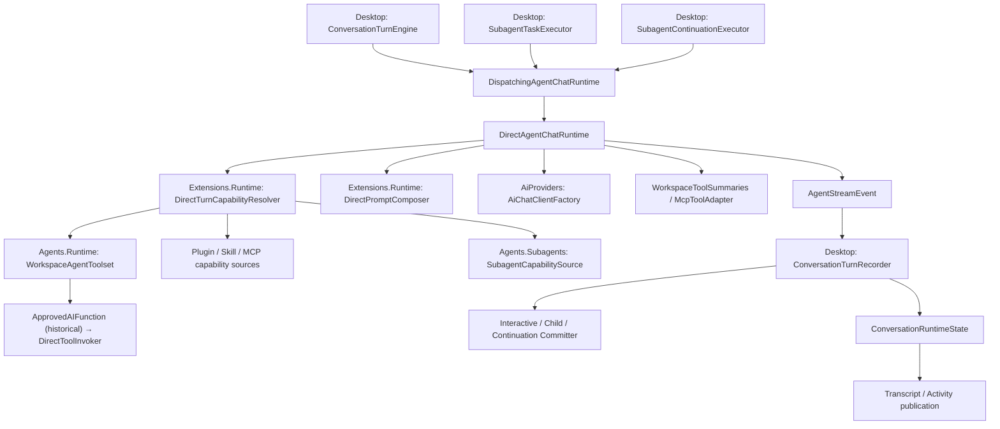

# Direct Agent 链路审查与整改结果

整改日期：2026-09-13。审查基线：`f66efa2dfabf1fb1d75ddc59de458c268ddb6298`。交付包含源码、正式回归测试与文档，随本次 Direct 重构提交一并记录。

> 2026-09-26 接缝更新：本文是 2026-09-13 Direct 整改的验证快照。其后 Direct hooks 阶段一重构（[hooks 设计](direct-hooks-system-design.md)）替换了两个接缝：`ApprovedAIFunction` → [`DirectToolInvoker`](../SelfClaw.Infrastructure/Agents/Direct/Tools/DirectToolInvoker.cs)（M.E.AI `FunctionInvoker`），`DirectTurnCapabilityLease.ToolDescriptors` → `Bindings`；provider 适配器改为从调用方接收按回合 `HttpClient`。本文中标注为“当前”的接缝描述已按下述更新，其余作为当时证据保留；当前接缝以 [运行流程](runtime-execution-flow.md) 为准。

开始时 `git status --short` 仅有未跟踪的本 review 文档，没有已有源码修改。本次保留原始审查全文于文末，并在当前源码上重新核实问题。

## 1. 完成结果

R01–R12 均已核实并实施。Direct 专属代码集中到 `Infrastructure/Agents/Direct`；能力规则、工具绑定/结果、默认模型准备分别有明确的解释位置。共享 recorder、provider adapters、lease scope、三种 committer 及原子事务边界继续保留。

最终全量 .NET 回归：**787 通过，0 失败，4 跳过，总计 791**。从独立目录 `bin/direct-refactor-final/` 构建并执行，避免运行中的 Desktop 占用默认 DLL，也避免依赖删除后复用旧输出目录中的残留文件。全方案 restore/build 成功，build 为 **0 警告、0 错误**。

## 2. R01–R12 逐项状态

| ID | 状态、当前实现与简化 | 验证证据 |
| --- | --- | --- |
| R01 | **完成。** [DirectToolInvoker](../SelfClaw.Infrastructure/Agents/Direct/Tools/DirectToolInvoker.cs)（安装为 M.E.AI `FunctionInvoker`，取代已删除的 `ApprovedAIFunction`）在审批后等待 `IToolExecutionCheckpoint`。现有 [continuation committer](../SelfClaw.Desktop/Services/Subagents/SubagentContinuationTurnCommitter.cs) 实现 checkpoint；[SQLite delivery repository](../SelfClaw.Infrastructure/Agents/Subagents/Persistence/SqliteSubagentDeliveryRepository.cs) 校验 lease、提交 `tool_execution_started_at_utc`，恢复与 retry 判定读取标记。detached 展示与中间工具记录仍隔离，终态仍原子提交。Schema v27 保守标记 v26 遗留 leased 行。 | [ContinuationRecoveryTests](../SelfClaw.Tests/Desktop/Services/Subagents/ContinuationRecoveryTests.cs) 经过真实 Workspace 写文件、SDK function invocation、Direct 事件与 recorder，在标记前、标记后/执行前、工具返回后/终态前中断；检查磁盘副作用、SQLite 标记、父 transcript 隔离与恢复结果。[schema tests](../SelfClaw.Tests/Infrastructure/Data/Sqlite/SqliteSubagentSchemaTests.cs) 覆盖 v26 升级。缺少 checkpoint 的 continuation 在准备前失败。 |
| R02 | **完成。** [dispatcher](../SelfClaw.Desktop/Services/Subagents/SubagentDeliveryDispatcher.cs) 的 `StartAdmittedContinuationAsync` 用 `try/finally` 统一“准入→领取→移交”；未移交时归还已知 lease 并释放准入。移交后由 [executor](../SelfClaw.Desktop/Services/Subagents/SubagentContinuationExecutor.cs) 唯一收尾；删除原 worker catch 中的重复完成。heartbeat 收尾失败也会进入准入释放，扫描异常不会终止后台循环。 | [SubagentDeliveryDispatcherTests](../SelfClaw.Tests/Desktop/Services/Subagents/SubagentDeliveryDispatcherTests.cs) 覆盖领取 I/O 失败、取消、空租约、领取后取消、成功移交及执行中取消，并重新准入证明未遗留 Running；另外覆盖失败父会话之后继续调度。 |
| R03 | **完成。** [DirectToolResult](../SelfClaw.Infrastructure/Agents/Direct/Tools/Models/DirectToolResult.cs) 显式携带状态、摘要、模型内容与展示内容；`Detail` 不参与模型序列化。工作区、Skill 与 subagent 在 SDK marshaller 中产生该契约，MCP 在自身结果适配层产生。主循环删除按工作区 DTO 类型推测结果的 switch 与 MCP 特判；写/Shell 包装恢复具体返回类型。 | [DirectToolPipelineTests](../SelfClaw.Tests/Infrastructure/Agents/Direct/DirectToolPipelineTests.cs) 使用真实 I/O、AIFunction、function invocation 和 SQLite recorder，覆盖 Shell exit 7、缺少审批处理器、正常读写。审批拒绝为 Canceled/Cancelled；Skill 验证失败为 Failed。HTTP MCP fixture 保留 `isError`。四种 [provider 请求序列化测试](../SelfClaw.Tests/Infrastructure/AiProviders/AiModelConfigurationRequestTests.cs) 验证内容与状态未丢失且展示字段不重复。 |
| R04 | **完成。** [Agents/Direct](../SelfClaw.Infrastructure/Agents/Direct/DirectAgentChatRuntime.cs) 归拢 runtime、Capabilities、Context、Tools；Extensions 只拥有包/缓存/连接资源，没有对 Direct 的反向引用。`DirectToolBinding` 把函数与描述符放在一起；最终组装集中检查冲突、过滤策略并安装审批/checkpoint，lease 从同一批绑定派生工具表与索引。删除中央工作区名称表、两份来源集合与 MCP 修改调用者集合的模式。 | 行为批次 `direct-contracts.trx` **485 通过**；只做目录/命名空间迁移后的 `direct-layout.trx` 同样 **485 通过**。binding 冲突、无工具无描述符、MCP 名称归一化冲突有正式回归。共享 recorder 未复制。 |
| R05 | **完成。** [DirectCapabilityRules](../SelfClaw.Infrastructure/Agents/Direct/Capabilities/DirectCapabilityRules.cs) 共用工具策略、版本/hash、安装、Plugin/Skill 关系与 MCP revision 判定。[SubagentTaskPreflight](../SelfClaw.Infrastructure/Agents/Subagents/Runtime/SubagentTaskPreflight.cs) 移到 Infrastructure；Desktop 通过 `ISubagentTaskPreflight` 保留受理与执行前检查，不再解释存储规则。`IAiModelCatalog.IsModelAvailableAsync(id)` 使用单项读取。 | [capability resolver tests](../SelfClaw.Tests/Infrastructure/Agents/Direct/Capabilities/DirectTurnCapabilityResolverTests.cs) 覆盖受理后禁用、升级、删除、MCP revision/enablement 变化：preflight 与 child 拒绝，continuation 收缩。既有 queued task/preflight 回归全部通过。 |
| R06 | **完成。** [AiChatClientFactory](../SelfClaw.Infrastructure/AiProviders/AiChatClientFactory.cs) 分为 `PrepareAsync(Guid?)` 和 `Create(preparation, pipeline)`；先一次解析有效模型，再能力准备，最后构造按回合 `HttpClient` 并把工具、`FunctionInvoker` 与可选 HTTP handler 交给 provider options/pipeline。删除 `CreateForScopeAsync`、`AiChatRuntimeInputs`，以及 Desktop 默认模型补齐与相应 model catalog 依赖。 | [runtime tests](../SelfClaw.Tests/Infrastructure/Agents/Direct/DirectAgentChatRuntimeTests.cs) 覆盖空模型 id＋子代理绑定、无效模型不进入能力解析；[factory tests](../SelfClaw.Tests/Infrastructure/AiProviders/AiChatClientFactoryTests.cs) 覆盖默认选择、档案/连接失效、`FunctionInvoker` 接线与按回合 client 释放。child/continuation 保持捕获的具体模型 id。 |
| R07 | **完成。** [DirectPromptComposer](../SelfClaw.Infrastructure/Agents/Direct/Context/DirectPromptComposer.cs) 从最近 unit 向前按需构建、计费，超出连续尾部预算即停止；删除全量 SDK history 构建与全量工具 GroupBy 索引。仅候选单元解析参数/序列化结果；工具索引按需向后增长，无预算时每条工具记录也只扫描一次。 | 原有回放、顺序、截断续写与 mandatory budget 测试通过。正式分配回归在 4096 context / 512 reserve 下，100 与 1,000 条旧工具消息均保留 3 条 SDK 消息，分配均为 **37,168 字节**；输入构造不计入测量。这是局部 Debug 分配结果，不是 provider 延迟测量。 |
| R08 | **完成。** [ConversationSessionCoordinator](../SelfClaw.Desktop/Services/Runtime/ConversationSessionCoordinator.cs) 只在加载表中保留进行中的 I/O；完成/失败/取消后移除。完成快照仅保留当前选中会话，运行会话另归 runtime state。调用者取消自己的等待，不取消共享加载。没有新增通用缓存框架。 | [session tests](../SelfClaw.Tests/Desktop/Services/Runtime/ConversationSessionCoordinatorTests.cs) 覆盖失败/底层取消后直接重试、取消等待者不污染共享读取、访问 40 个会话后旧会话重新读取，以及运行态与 detached 隔离。 |
| R09 | **完成。** [WorkspaceShellRunner](../SelfClaw.Infrastructure/Tools/Workspace/WorkspaceShellRunner.cs) 同时增量 drain 两个管道，各保留前 24,000 字符并继续丢弃超额输出。所有退出路径 kill/等待读取收尾，内部管道关闭最多等待 2 秒；保留截断标记并避免截断 surrogate pair。 | [Shell tests](../SelfClaw.Tests/Infrastructure/Tools/Workspace/WorkspaceShellRunnerTests.cs) 输出 stdout/stderr 各 8 Mi 字符，仍只有两个固定前缀；exit 7、UTF-8/换行、持续输出时的超时与取消均通过。 |
| R10 | **完成。** [McpToolResultFormatter](../SelfClaw.Infrastructure/Agents/Direct/Tools/McpToolResultFormatter.cs) 拥有规范化、摘要和预算；在完整 DirectToolResult 加入包装/提示并序列化后验证 **65,536 UTF-8 字节**，按可容纳前缀裁剪，保留 `isError`。审批包装不再承担 transformResult。 | [MCP tests](../SelfClaw.Tests/Infrastructure/Agents/Direct/Tools/McpToolAdapterTests.cs) 覆盖 ASCII、CJK、emoji、引号、反斜杠及多块 SDK 内容。[HTTP MCP fixture](../SelfClaw.Tests/Infrastructure/Extensions/McpHttpTransportIntegrationTests.cs) 实际调用 70,000 引号结果；四种 provider wire 测试验证最终工具 payload 不超预算且无展示字段重复。 |
| R11 | **完成。** [ready-mailbox SQL](../SelfClaw.Infrastructure/Agents/Subagents/Persistence/SqliteSubagentDeliveryRepository.cs) 接受排除的父会话集合；[engine](../SelfClaw.Desktop/Services/Runtime/ConversationTurnEngine.cs) 提供运行/删除状态快照，dispatcher 有界跳过竞争/失败候选并保留跨批扫描进度。父会话排他、用户准入优先、FIFO 合批及 4 个槽位不变。 | [dispatcher tests](../SelfClaw.Tests/Desktop/Services/Subagents/SubagentDeliveryDispatcherTests.cs) 使用真实 SQLite delivery 与 engine/session 准入，验证 A 忙而 B 开始，以及 A 领取失败而 B 开始；B 完成不释放 A 的交互状态。 |
| R12 | **完成。** [WorkspaceSearchService](../SelfClaw.Infrastructure/Tools/Workspace/WorkspaceSearchService.cs) 使用 bundled ripgrep glob，删除手写 regex 转换及无消费者的目录 walker。保留 workspace-relative、忽略 .gitignore、隐藏文件可见、隐藏/构建目录排除和最近 250 项排序契约；结果以有界 top-K 收集。 | [WorkspaceGlobTests](../SelfClaw.Tests/Infrastructure/Tools/Workspace/WorkspaceGlobTests.cs) 覆盖 `src/**/x.cs` 的零层、多层与 `prefixx.cs` 负例，`*`/`?`、Windows 分隔符、大小写、子目录 scope、隐藏/依赖目录、300 项截断和同时间排序。工作区批次 **41 通过**。 |

## 3. P3 清理与保留判断

| 项目 | 状态与证据 |
| --- | --- |
| Agent Framework 依赖 | **已删除。** 三个 csproj 的 `Microsoft.Agents.AI` 及中央版本声明均移除；之后重新 force-evaluate restore、全方案 build 与全量 test 成功。新输出目录的 `.deps.json` 不包含该库，未依靠旧目录残留 DLL。 |
| 未消费属性与返回值 | **已删除/简化。** 删除 `HasPendingThinking`，保留有消费者的 `CompleteThinking()`；`WriteTerminalOutcome`、`ReportUsage` 改为 void，usage 去重和终态协议保留；删除 history unit 的 `EndsTruncatedAssistant` 冗余字段及 disposition 的未用参数。 |
| 无意义包装与双重集合 | **已删除。** 三个 `Task<object>` 工作区包装、`AiChatRuntimeInputs`、`CreateForScopeAsync`、MCP 审批 transform、SubagentResultFunction 和 lease dispose 转发方法被替代；来源统一返回绑定，不再单独维护 Tools/Descriptors。 |
| 类型猜测与重复规则 | **已删除。** runtime 的工作区 DTO switch、MCP 结果特判和默认 Completed 分支；Desktop preflight 中重复的 ToolPolicyRank、版本/hash/安装/MCP 判定。 |
| 内部 API 边界 | **已收窄。** WorkspaceAgentToolset 与 IAiProviderRepository 为 internal；测试继续使用已有 friend assembly，没有加公开转发包装。 |
| 配置 DTO | **完成。** [StoragePaths](../SelfClaw.Infrastructure/Options/StoragePaths.cs) 为五个路径值的纯 record；环境解析移到 [StoragePathDefaults](../SelfClaw.Infrastructure/Options/StoragePathDefaults.cs)，由 composition root 使用，无新增服务接口。 |
| DTO 与服务文件 | **完成。** McpServerResolution、HTTP ClientConfiguration/ClientCacheKey 独立放 Models；MCP resolution 用 Connected 数据标志，不持有无须消费的资源引用。跨项目使用的子任务定义快照与 preflight failure 放 Core.Models。 |
| 契约/命名空间 | **完成。** IToolApprovalHandler 位于 Core/Interfaces/Approvals；SubagentDefinition 与其 catalog 命名空间跟随 Desktop/Services/Agents/Definitions。Direct 类型位置与职责一致。 |
| 库层异步 | **完成所涉路径。** 工作区无意义 async 包装删除；SqliteDatabase、SqliteConversationRepository 等所涉 await 补齐 ConfigureAwait(false)。实际调用者取消继续传播，Shell 内部管道关闭取消仅用于清理。 |
| 混入 workspace 的宽接口 | **已抽离真实边界。** [IWorkspaceRootRepository](../SelfClaw.Core/Interfaces/Workspaces/IWorkspaceRootRepository.cs) 承担 3 项 CRUD；实现并入现有 Git workspace 仓库并改名 [SqliteWorkspaceRepository](../SelfClaw.Infrastructure/Data/Sqlite/Repositories/SqliteWorkspaceRepository.cs)，没有另增仓库包装。Git 服务不再依赖 IConversationRepository；recorder/engine 的 test doubles 删除无消费者 workspace 方法。 |
| provider 管理仓库 16 方法 | **保留，有消费者。** CRUD 为设置管理服务所用，已限制在 Infrastructure 内部；运行前模型检查使用窄 IAiModelCatalog。没有为凑方法数量继续拆接口。 |
| 导航与旧实现 | **已同步。** AGENTS 删除不存在的 `docs/agents/*`、`docs/adr/` 导航和不存在的 Feishu/DesktopChannelManager/DesktopSettingsStore 源码说明；CONTEXT 与运行流程同步。原设计稿显式标为历史，当前入口指向本结果。 |

## 4. 复核后没有重复整改的设计

- Core.csproj 只有 net10.0 基础配置，没有 Core→Infrastructure 项目引用倒置。
- 共享 recorder、活动状态、三种 committer 与 terminal/delivery 原子事务已经成立，继续保留；没有复制出 Direct recorder。
- 流式 StringBuilder、revision 物化、发布合并和首个可见 delta 即时发布原本有效，本次未当作逐 token 全量重建处理。
- CapabilityContentCache 的共享读取取消隔离与失败项精确驱逐原本成立；R08 修的是会话 coordinator 的长期内容保留，不是删除该包缓存。
- provider 适配器、Plugin/MCP lease scope 是实际替换与资源所有权边界，保留。

## 5. 验证记录

环境：Windows，.NET SDK 10.0.400。所有阶段使用独立输出目录；最终目录是新建的 `bin/direct-refactor-final/`。

```powershell
$env:DOTNET_CLI_HOME = 'D:\Repositories\SelfClaw\.dotnet'
$env:DOTNET_SKIP_FIRST_TIME_EXPERIENCE = '1'
$env:DOTNET_NOLOGO = '1'
dotnet restore SelfClaw.slnx --force-evaluate
dotnet build SelfClaw.slnx --no-restore -p:BaseOutputPath=bin/direct-refactor-final/
dotnet test SelfClaw.Tests/SelfClaw.Tests.csproj --no-build --no-restore -p:BaseOutputPath=bin/direct-refactor-final/ --logger 'trx;LogFileName=full-dotnet-final.trx' --results-directory TestResults/direct-refactor --verbosity minimal
```

本地 TRX 在 `TestResults/direct-refactor/`，该目录由仓库忽略。阶段结果分别验证当时的小批次，不相加：

| 产物 | 通过 / 失败 / 跳过 |
| --- | --- |
| state-boundary.trx | 44 / 0 / 0 |
| tool-contract.trx | 232 / 0 / 0 |
| direct-contracts.trx | 485 / 0 / 0 |
| direct-layout.trx（纯目录迁移） | 485 / 0 / 0 |
| prompt-budget.trx | 49 / 0 / 0 |
| cache-shell.trx | 54 / 0 / 0 |
| output-budgets.trx | 23 / 0 / 0 |
| continuation-scheduling.trx | 33 / 0 / 0 |
| workspace-regression.trx | 41 / 0 / 0 |
| cleanup-regression.trx | 358 / 0 / 0 |
| recovery-cache-budget.trx | 54 / 0 / 0 |
| provider-tool-wire.trx | 6 / 0 / 0 |
| **full-dotnet-final.trx（最终实际产物）** | **787 / 0 / 4** |

## 6. 明确限制

1. checkpoint 是“可能执行”的恢复证据，不承诺外部副作用 exactly-once。v26 遗留 lease 无法证明未执行，因此升级后保守 DeadLetter；未提交正文可能丢失。租约提交但调用方未收到返回时依靠过期恢复收敛。
2. token 估算仍为启发式；R07 限制的是 SDK 历史构建/序列化分配，数据库历史加载与 Skill token 扫描仍会读取/遍历历史。当前选中与运行中的长会话本身仍占用内存。
3. Direct 事件 Channel 仍无界；warm MCP acquire 后的 health SQL/revision 通知没有合并。原审查把它们列为待测量项，本次未把缺少测量的项宣称为已解决的性能故障。
4. 4 项 smoke 按现有开关跳过：真实 WPF/WebView2、桌面进程强杀恢复的两个场景、真实 provider reasoning。其余回归包括真实 Shell 子进程、SQLite、HTTP MCP fixture 与四种 provider SDK 请求序列化。没有 Vue 源码改动，未运行 Vue 测试。

当前职责与执行流程见 [runtime-execution-flow.md](runtime-execution-flow.md)。

---

<details>
<summary>原始审查全文（基线证据，保留历史描述与当时的位置）</summary>

以下描述及路径/行号对应最初审查基线；当前源码位置和处理状态以上面的整改表为准。


# Direct Agent 链路代码审查

审查日期：2026-09-13<br>
代码基线：`f66efa2dfabf1fb1d75ddc59de458c268ddb6298`<br>
目标：让 Direct 架构职责清晰、状态所有权明确、性能成本可控，便于继续维护。

## 1. 结论

当前已经具备值得保留的基础：Direct/CLI 共用事件协议，provider 适配与凭据处理集中在 Infrastructure，能力资源通过 lease 释放，交互回合、子任务和 continuation 共用 recorder，并分别实现自己的原子提交。

主要维护成本集中在三处：**Direct 编排与 Extensions 相互依赖；同一能力规则由 Desktop 和 Infrastructure 分别解释；运行、展示、持久化和恢复状态之间缺少完整的一致性约束。** 性能方面，已有缓存和流式合并解决了部分问题，但历史预算之前的全量构建、会话缓存生命周期、Shell 输出收集仍有明显改进空间。

发现 **2 项 P1、10 项 P2**，另列低优先级清理项。最先处理的两项都涉及 continuation：工具执行记录不足以支撑崩溃后的重试判断，以及租约获取失败后准入状态未释放。两项均有本地故障注入证据。

建议在现有项目内渐进整理：先修复状态所有权，再统一 Direct 准备流程、能力规则和工具结果契约，随后处理有证据的性能问题。保留有实际用途的接口、lease 和事务边界。

## 2. 范围与验证方法

沿实际调用链检查了交互 Direct 回合、子代理执行和父代理 continuation，包括能力解析、prompt 重建、provider client、工具审批、MCP 池、流式事件、recorder、终态提交及相关恢复逻辑。Vue 只作为发布边界参考，CLI 内部实现、插件安装器和整个数据库迁移体系不属于本次全面审查范围。

以下是相关目录盘点，包含空行和注释；数量用于定位复杂度集中点，不作为缺陷判据，也不表示每个外围类型都做了同等深度的审查。本文目录表省略 `SelfClaw.` 项目前缀。

| 目录 | C# 文件数 | 行数 |
| --- | ---: | ---: |
| `Infrastructure/Agents/Runtime` | 5 | 870 |
| `Infrastructure/Agents/Subagents` | 9 | 2,359 |
| `Infrastructure/Extensions/Runtime` | 17 | 2,061 |
| `Infrastructure/Extensions/Mcp` | 10 | 1,301 |
| `Infrastructure/AiProviders` | 30 | 2,883 |
| `Infrastructure/Tools/Workspace` | 8 | 1,564 |
| `Desktop/Services/Runtime` | 17 | 2,009 |
| `Desktop/Services/Subagents` | 29 | 2,768 |

验证结果：

- Direct、Extensions、AiProviders、Subagents 和 Desktop Runtime 相关现有测试：**430 通过，0 失败，0 跳过**。
- Workspace 工具现有测试：**28 通过，0 失败，0 跳过**。
- 本地探针使用当前构建产物，验证工具结果映射、continuation 准入失败、detached 工具恢复、MCP 结果限长、glob 匹配和 prompt 构建分配。
- 未调用真实 AI provider；性能数据是本机 Debug 构建下的局部测量。未执行真实进程强杀或完整 WPF/WebView2 交互测试。

最初使用默认输出目录时，构建被运行中的 Desktop 占用 DLL 阻止；改用各项目的 `bin/direct-review/` 后完成验证。审查未修改产品代码。文中行号均对应上述基线。

## 3. 当前职责分布



这里的维护问题是模块职责和依赖方向，**没有发现 Core → Infrastructure 的项目引用倒置**。例如 `Extensions.Runtime` 实际承担了整个 Direct 的能力编排，而 Direct 的工具层又反向依赖其中的审批实现。只修改命名空间、保留原依赖关系，不能消除这部分复杂度。

## 4. 问题清单

P1 表示需优先修复的执行正确性或生命周期问题；P2 表示需要计划整改的契约、架构或性能问题；P3 清理项单列于第 5 节。

| ID | 优先级 | 问题 | 主要性质 | 证据 |
| --- | --- | --- | --- | --- |
| R01 | P1 | detached recording 没有恢复所需的工具执行标记 | 状态职责、恢复正确性 | recorder + SQLite 探针 |
| R02 | P1 | continuation 准入成功后，租约获取异常会遗留 Running 状态 | 生命周期所有权 | 故障注入探针 |
| R03 | P2 | 工具实际结果类型与运行时解释逻辑不一致 | 类型契约、无效分支 | 真实 AIFunction 探针 |
| R04 | P2 | Direct 专属编排散落在 Extensions，工具及描述符组装缺少统一边界 | 模块职责、文件归属 | 调用及依赖追踪 |
| R05 | P2 | 能力授权和有效性规则跨项目重复 | 规则所有权、重复查询 | 多入口实现对照 |
| R06 | P2 | 默认模型解析依赖 Desktop 提前补齐，Direct 请求契约不自洽 | 准备流程、可空类型 | 三种入口对照 |
| R07 | P2 | prompt 先全量重建、序列化历史，再执行预算裁剪 | 分配、长会话成本 | 局部分配测量 |
| R08 | P2 | 会话加载字典兼任永久内容缓存和进行中的加载状态 | 类型职责、内存、失败恢复 | 生命周期追踪 |
| R09 | P2 | Shell 输出只在读取完毕后截断 | 内存边界、取消收尾 | 生产路径追踪 |
| R10 | P2 | MCP 结果重新序列化后可超过声明上限 | 输出契约、职责混合 | 序列化探针 |
| R11 | P2 | 一个忙碌父会话会挡住其他父会话的 continuation | 跨模块调度复杂度 | SQL + dispatcher 对照 |
| R12 | P2 | 手写 glob 到正则的转换已有目录边界错误 | 重复实现、维护成本 | 匹配探针 |

### R01 — detached recording 把展示隔离与执行恢复绑定在一起

**位置：** [SubagentContinuationExecutor.cs:118](../SelfClaw.Desktop/Services/Subagents/SubagentContinuationExecutor.cs#L118)、[ConversationTurnRecorder.cs:55](../SelfClaw.Desktop/Services/Runtime/ConversationTurnRecorder.cs#L55)、[SqliteSubagentDeliveryRepository.cs:321](../SelfClaw.Infrastructure/Agents/Subagents/Persistence/SqliteSubagentDeliveryRepository.cs#L321)。

Continuation 使用 `ApplyDetachedEventAsync()`，该入口固定传入 `persistToolProgress: false`。工具开始、完成时只更新内存，跳过 [StartToolRunAsync 的写入](../SelfClaw.Desktop/Services/Runtime/ConversationTurnRecorder.cs#L228) 和 [CompleteToolRunAsync 的写入](../SelfClaw.Desktop/Services/Runtime/ConversationTurnRecorder.cs#L263)。成功或失败终态到来后，committer 才统一提交工具记录。

但是，租约过期恢复通过 [HasRecordedToolsAsync](../SelfClaw.Infrastructure/Agents/Subagents/Persistence/SqliteSubagentDeliveryRepository.cs#L606) 查询 `tool_runs`，据此选择 DeadLetter 或自动重试。这两个模块对“没有工具记录”的含义不一致：它既可能表示没执行工具，也可能表示已执行但尚未提交终态。

**验证：** 用真实 recorder 和 SQLite 创建一次 leased continuation，注入工具开始及完成事件，保留未提交终态的状态，再推进恢复时间。结果为：内存工具数 **1**，数据库工具数 **0**，恢复产生的 DeadLetter 数 **0**，该 mailbox **再次可自动重试**。探针没有执行外部工具，也没有强杀进程；它验证的是崩溃时可留下的持久化状态。

如果此时实际工具已追加文件、执行命令或提交 MCP 操作，重试可能再次产生副作用。现有 [恢复测试:496](../SelfClaw.Tests/Infrastructure/Agents/Subagents/Persistence/SqliteSubagentTaskRepositoryTests.cs#L496) 手工写入 `tool_runs` 后再检查 DeadLetter，未覆盖生产 recorder 不写该行的路径。

**建议：** 将“允许发布父 transcript”和“必须留下执行恢复标记”拆成两个独立约束。为 continuation 在工具可能产生副作用之前持久化执行标记，并由恢复逻辑读取该标记；父 transcript 仍可在终态原子提交后发布。标记应在工具调用边界写入并等待完成，因为 Direct 的事件 Channel 不保证消费者已落库后 producer 才执行工具。单纯把 `persistToolProgress` 改成 `true` 仍有时序窗口。

**验收：** 在执行标记前、标记后、工具返回后、终态提交前分别注入中断；可能已执行工具的 continuation 不自动重放，尚未执行工具的失败仍可按现有规则重试。标记表示“可能开始执行”，不承诺外部工具 exactly-once。

### R02 — continuation 准入的获取与释放不在同一异常边界

**位置：** [SubagentDeliveryDispatcher.cs:128](../SelfClaw.Desktop/Services/Subagents/SubagentDeliveryDispatcher.cs#L128)、[ConversationTurnEngine.cs:97](../SelfClaw.Desktop/Services/Runtime/ConversationTurnEngine.cs#L97)。

`TryStartContinuationAsync()` 先通过 engine 注册 detached Running 状态，再调用 `TryLeaseBatchAsync()`。它只在租约返回 `null` 时调用 `CompleteContinuationAsync()`。如果租约获取抛出 I/O 异常或取消异常，执行尚未交给 `RunContinuationAsync()`，后者的收尾逻辑不会运行。后台扫描外层也没有补偿这个已获得的准入。

**验证：** 给 `TryLeaseBatchAsync()` 注入 `IOException` 后，异常正常传播，但真实 session coordinator 的 `IsRunning(parentId)` 仍为 **true**。后续交互回合和 continuation 会被该状态拒绝。普通异常还会逃出后台扫描循环。

**建议：** 在 dispatcher 中用一个明确的 `try/finally` 覆盖“准入成功 → 获取租约 → 移交 executor”。移交前由 dispatcher 负责释放；移交后由 executor 负责。已获得租约但尚未移交的失败还要明确归还或收敛租约。这里可以用局部控制流完成，不需要通用生命周期框架。

**验收：** 覆盖准入后取消、租约获取异常、租约返回空、成功移交四条路径；每次准入恰好释放一次，其他父会话的后台投递能够继续。

### R03 — 工具结果契约错位，DTO 分支只在部分 fake 中生效

**位置：** [WorkspaceAgentToolset.cs:34](../SelfClaw.Infrastructure/Agents/Runtime/WorkspaceAgentToolset.cs#L34)、[ApprovedAIFunction.cs:69](../SelfClaw.Infrastructure/Extensions/Runtime/ApprovedAIFunction.cs#L69)、[DirectAgentChatRuntime.cs:324](../SelfClaw.Infrastructure/Agents/Runtime/DirectAgentChatRuntime.cs#L324)。

工作区工具由 `AIFunctionFactory.Create()` 创建，实际调用结果是 `JsonElement`。这一点已有 [工具测试:62](../SelfClaw.Tests/Infrastructure/Agents/Runtime/WorkspaceAgentToolsetTests.cs#L62) 证明。运行时的 `DescribeToolResult()` 却主要用 `WorkspaceFileContent`、`WorkspaceFileWriteResult`、`ShellCommandResult` 等 DTO 分支解释结果；对于实际进入的 `JsonElement`，统一返回 Completed 和 `Tool call completed.`。

**验证：** 调用真实 AIFunction 包装、让底层 fake 返回退出码 **7**，运行时仍解释为 **Completed**。缺少审批处理器而拒绝写文件时，底层写入没有发生，但拒绝结果也被解释为 **Completed**。审批阻止执行本身有效，错误出在事件及持久化结果语义。

现有 [runtime 测试:41](../SelfClaw.Tests/Infrastructure/Agents/Runtime/DirectAgentChatRuntimeTests.cs#L41) 手工构造 DTO 类型的 `FunctionResultContent`，绕开真实的封送边界。新增工具还需要修改中央运行时的类型 switch，增加了功能模块与主循环之间的耦合。

**建议：** 由工具适配层明确携带成功、失败、拒绝的执行语义，再统一生成模型结果和 `ToolCallCompletedEvent`。Direct 主循环只处理统一契约。对当前不可达的 DTO 解释分支，随契约修复一并删除或调整；不继续增加按 CLR 类型猜测结果的分支。工作区包装方法也应保留具体返回类型，消除无必要的 `Task<object>` 转换。

**验收：** 用“实际 WorkspaceAgentToolset → 实际函数调用管线 → Direct 事件 → recorder”的边界测试覆盖非零退出码、审批拒绝和正常读写；同时保留 MCP `isError` 的语义。

### R04 — Direct 能力编排的模块归属与数据组装方式不统一

**位置：** [DirectTurnCapabilityResolver.cs:34](../SelfClaw.Infrastructure/Extensions/Runtime/DirectTurnCapabilityResolver.cs#L34)、[DirectPromptComposer.cs:44](../SelfClaw.Infrastructure/Extensions/Runtime/DirectPromptComposer.cs#L44)、[McpCapabilitySource.cs:41](../SelfClaw.Infrastructure/Extensions/Runtime/McpCapabilitySource.cs#L41)、[WorkspaceAgentToolset.cs:8](../SelfClaw.Infrastructure/Agents/Runtime/WorkspaceAgentToolset.cs#L8)。

`DirectTurnCapabilityResolver` 有 505 行，既组装工作区、Skill、Plugin、MCP、Subagent 工具，又处理不同 origin 的能力上限、降级、校验和工具策略。`DirectPromptComposer` 负责整个历史回放与预算，却也位于 `Extensions.Runtime`。与此同时，工作区工具引用该目录的审批包装，审批包装又引用 `WorkspaceAgentToolset.DeniedResult`；运行时还直接引用 MCP 结果解释器。

工具组装同时维护 `List<AITool>` 和独立的描述符字典。Workspace 使用手写名称表，Skill 返回两份集合，MCP 接受调用者的可变集合并直接修改，Subagent 返回 tuple。冲突策略也分别采用赋值、`TryAdd`、`Add`。即使没有 workspace，基础描述符表仍会创建。维护者必须在多个文件中保证“工具与描述符一一对应”。

**建议：** 给 Direct 专属的准备、能力适配、prompt 和工具绑定一个统一模块归属，见第 6 节。能力来源返回独立结果，最终组装器集中做名称冲突检查和策略过滤。用一个简单的工具绑定 record 表达 AIFunction 与描述符的对应关系，在最后一步生成 SDK 列表及查找索引。已有 lease scope 继续独立拥有资源，不把它混入这个数据 record。

**验收：** 新增一种 Direct 工具时，不必同步改中央名称表、中央 DTO 类型 switch 和另一份工具列表；Extensions 的包读取和 MCP 连接代码不反向依赖 Direct 主运行时。目录调整和行为调整分批完成。

### R05 — 能力授权规则跨项目重复，前置检查依赖存储细节

**位置：** [SubagentTaskPreflight.cs:25](../SelfClaw.Desktop/Services/Subagents/SubagentTaskPreflight.cs#L25)、[DirectTurnCapabilityResolver.cs:189](../SelfClaw.Infrastructure/Extensions/Runtime/DirectTurnCapabilityResolver.cs#L189)、[ExtensionInstallation.cs:16](../SelfClaw.Infrastructure/Extensions/ExtensionInstallation.cs#L16)。

Desktop preflight 和 Infrastructure resolver 分别维护 `ToolPolicyRank`、版本/hash 比较、安装有效性、Skill/Plugin 关系和 MCP revision 规则。已经存在实现差异：preflight 的 `IsCurrent()` 要求指定 manifest 文件存在，`ExtensionInstallation.IsIntact()` 对 Plugin 只要求目录存在；插件内 Skill 的校验路径也分别实现。

preflight 在任务受理和执行前各运行一次。执行前再次检查有必要，但每次为了判断一个模型是否可用，都会调用 [ListEnabledModelsAsync:399](../SelfClaw.Infrastructure/AiProviders/AiProviderSettingsService.cs#L399)，读取全部 enabled profiles 和全部 provider connections，构建面向列表展示的 `EnabledModelView`，然后做一次 `Any`。此外还读取全部 packages 和 MCP servers；进入 Direct resolver 后又读取相关目录。

**建议：** 将能力判定收敛为一个规则实现，以明确的目录快照和捕获的 capability ceiling 为输入。保留受理时、执行前两个检查时点；interactive 降级、subagent 严格失败、continuation 收缩能力属于明确的调用策略。模型单项有效性使用针对 id 的读取能力，不借助整个 UI 列表投影。`none/read-only/system` 在配置入口解析为明确类型或统一策略值。

**验收：** 同一组 package/model/MCP 状态，在不同入口得到一致的底层判定；不同 origin 的错误处理差异仍被测试明确表达。禁用、升级、删除发生在排队期间时，执行前检查仍有效。

### R06 — 默认模型解析和能力解析的先后依赖泄漏给 Desktop

**位置：** [DirectChatTurnRequest.cs:16](../SelfClaw.Core/Runtime/Requests/DirectChatTurnRequest.cs#L16)、[DirectAgentChatRuntime.cs:168](../SelfClaw.Infrastructure/Agents/Runtime/DirectAgentChatRuntime.cs#L168)、[SubagentCapabilitySource.cs:38](../SelfClaw.Infrastructure/Agents/Subagents/Runtime/SubagentCapabilitySource.cs#L38)、[ConversationTurnEngine.cs:392](../SelfClaw.Desktop/Services/Runtime/ConversationTurnEngine.cs#L392)。

请求允许 `ModelProfileId = null`，运行时也提供 `CreateForScopeAsync()` 的默认模型分支。但是能力解析发生在该分支之前；启用了子代理支持且 Agent 绑定了 subagents 时，`SubagentCapabilitySource` 会因为没有具体父模型 id 先抛异常，默认模型分支无法到达。

当前 Desktop 交互入口提前解析默认模型，child 和 continuation 也传递具体模型，因此通常绕开了这个矛盾。代价是 Direct 的正确准备顺序由调用者补齐。无效或已禁用的显式模型，也要等能力组装、可能的 MCP 准备结束后才由 factory 拒绝。

**建议：** 在 Direct 入口先确定一次有效模型选择，形成内部必含具体模型 id 的执行输入，再解析依赖该输入的能力和工具，最后绑定 provider options。保留外部请求的默认模型语义，但把默认选择的所有权放在同一处；删除重复的兜底和调用者补偿。

**验收：** 同一个 Direct 请求分别从 Desktop 和直接 runtime 调用进入时行为一致；默认模型加 subagent 工具可正常准备，无效模型在昂贵能力准备前失败；已排队子任务继续使用捕获的具体模型。

### R07 — 预算控制了发送量，但没有控制预算计算之前的工作量

**位置：** [DirectPromptComposer.cs:78](../SelfClaw.Infrastructure/Extensions/Runtime/DirectPromptComposer.cs#L78)、[BuildAssistantUnit:202](../SelfClaw.Infrastructure/Extensions/Runtime/DirectPromptComposer.cs#L202)、[EstimateMessageTokens:254](../SelfClaw.Infrastructure/Extensions/Runtime/DirectPromptComposer.cs#L254)。

`BuildMessages()` 先为全部 tool runs 建索引，再为所有历史消息创建 SDK `ChatMessage/AIContent`。每个 assistant unit 还会解析工具参数、序列化工具结果并估算 token。直到这些工作完成后，才从尾部选择能进入预算的单元。大量马上会被丢弃的历史，已经支付了完整构建与分配成本。

**验证：** 使用 4096 token context、512 token output reserve，每条历史 assistant 记录包含一次工具调用和 8192 字节 ASCII 结果。预热后采样三次，取中位数；测量不包含构造输入记录的成本。

| 历史 assistant 记录数 | 最终 SDK 消息数 | 构建分配字节 | 本次本机耗时中位数 |
| ---: | ---: | ---: | ---: |
| 100 | 3 | 1,832,864 | 1.89 ms |
| 1,000 | 3 | 18,316,720 | 18.08 ms |

这说明保留的 prompt 大小固定时，丢弃历史仍带来近似线性增长的准备分配。数据是局部构建测量，不是实际 provider 首 token 延迟。

**建议：** 按当前“保留连续尾部、工具调用与结果不可拆分”的规则，从最近的 unit 开始按需重建和计费，达到裁剪边界即可停止。历史工具结果只为候选单元解析或序列化；先用这个直接的算法调整减少工作量，再依据测量决定是否需要有版本约束的 token 估算缓存。

**验收：** 保留现有工具回放、截断续写、mandatory budget 等测试；固定保留窗口，增加远端旧历史时，不再产生与全部旧工具结果大小成比例的 SDK 消息及序列化分配。

### R08 — 会话加载状态与完成内容缓存共用一个无界字典

**位置：** [ConversationSessionCoordinator.cs:13](../SelfClaw.Desktop/Services/Runtime/ConversationSessionCoordinator.cs#L13)、[SelectAsync:57](../SelfClaw.Desktop/Services/Runtime/ConversationSessionCoordinator.cs#L57)、[CompleteTurn:133](../SelfClaw.Desktop/Services/Runtime/ConversationSessionCoordinator.cs#L133)、[GetTranscriptSnapshotAsync:283](../SelfClaw.Desktop/Services/Runtime/ConversationSessionCoordinator.cs#L283)。

`_transcriptLoads` 的值既可能是进行中的数据库加载，又可能是完整会话内容的已完成 Task。访问过的会话、每个完成回合的全部消息及工具结果都会保留，通常直到删除会话或销毁 coordinator 才移除。它没有容量、字节预算或闲置淘汰策略。

失败或取消的加载 Task 也没有在失败路径移除。直接重试 `StartTurnAsync()` 会再次 await 同一个失败 Task；重新选择会话覆盖该项后才有机会恢复。加载还持有创建它的调用者的 cancellation token，使共享状态和单次调用生命周期混在一起。

**建议：** 明确区分进行中的加载与可复用的已完成快照。加载结束后移除进行中项；仅缓存成功快照，并给非当前会话设置小容量或字节上限。取消由调用者等待行为表达，避免一个等待者取消长期污染缓存。可以在本类内完成这些职责拆分，不引入通用缓存框架。

**验收：** 加载失败或取消后，直接重试可重新读取；连续访问许多历史会话后缓存有明确上限；当前运行会话、detached continuation 和选中会话的隔离行为保持不变。

### R09 — Shell 的返回长度限制无法限制收集过程的内存

**位置：** [WorkspaceShellRunner.cs:36](../SelfClaw.Infrastructure/Tools/Workspace/WorkspaceShellRunner.cs#L36)、[CreateResult:85](../SelfClaw.Infrastructure/Tools/Workspace/WorkspaceShellRunner.cs#L85)。

stdout/stderr 使用 `ReadToEndAsync()` 无界读取，等待进程结束后才各截断到 24,000 字符。编译日志、目录扫描或持续打印命令即使最后只返回少量字符，也会先在进程内积累全部输出。现有最大 600 秒执行时间限制并不能为输出内存提供上限。

发生超时或取消时，方法会 kill 进程，但两个输出读取任务不经过统一的有界收尾。输出缓冲、进程寿命和取消收敛应由这个类型一并负责。

**建议：** 增量 drain 两个管道，只保留规定大小的首部或首尾缓冲，并继续读取或丢弃超额数据，避免阻塞子进程。明确截断标记和保留策略；所有退出路径统一等待或有界收敛读取任务。无需更换现有工作区工具接口。

**验收：** 让进程产生明显超过返回上限的输出，内存增长受缓冲上限约束；stdout/stderr 同时高输出、超时和取消均能结束；保留 UTF-8 和换行行为。

### R10 — MCP 限长在重新序列化之后失效，审批包装混入结果转换

**位置：** [McpToolAdapter.cs:80](../SelfClaw.Infrastructure/Extensions/Mcp/McpToolAdapter.cs#L80)、[ApprovedAIFunction.cs:21](../SelfClaw.Infrastructure/Extensions/Runtime/ApprovedAIFunction.cs#L21)。

`LimitModelResult()` 先检查 `JsonElement.GetRawText().Length`，超长后截取 JSON 字符串，再把片段放进另一个对象进行序列化。反斜杠、引号等再次转义会扩大结果，所以输入片段短于上限不代表最终结果符合上限。此外，标注的 KiB 实际按 UTF-16 字符计数；`DescribeResult()` 接受的 `IEnumerable<AIContent>` 形式，在 limiter 中直接透传。

**验证：** 工具正文为 70,000 个双引号时，输入 JSON 为 420,055 字节，所谓限长后仍有 **75,429 字节/字符**，超过常量 **65,536**。这是最终序列化产物超过上限的局部复现。

目前转换函数通过 `ApprovedAIFunction.transformResult` 注入，使审批类型同时承担 MCP 内容整形；拒绝审批又在转换前直接返回。该包装的职责正在随着结果类型扩张。

**建议：** 审批包装只负责审批与调用准入；MCP 适配层负责结果规范化及大小限制。确定限制单位，并在加入提示文本、包装和转义后的最终表示上验证上限。覆盖实际允许的内容形式，保留 `isError` 等结果语义。存储和显示层可以拥有各自的预算，但不能把它们当作模型输入上限。

**验收：** ASCII、CJK、emoji、引号、反斜杠及多块内容均满足最终预算；输出仍是合法结构，错误状态、截断说明和摘要保持可用。

### R11 — 数据库的“最早 mailbox”与内存准入状态形成队头阻塞

**位置：** [SqliteSubagentDeliveryRepository.cs:47](../SelfClaw.Infrastructure/Agents/Subagents/Persistence/SqliteSubagentDeliveryRepository.cs#L47)、[SubagentDeliveryDispatcher.cs:108](../SelfClaw.Desktop/Services/Subagents/SubagentDeliveryDispatcher.cs#L108)。

`PeekReadyMailboxAsync()` 按时间排序并 `LIMIT 1`，只排除已有数据库 lease 的父会话。dispatcher 随后才询问 engine 该父会话是否正在运行交互回合。如果准入失败，立即返回 `false`，本轮扫描停止。下一次扫描仍会取得同一个最早 mailbox。

因此，在 A 的较早 delivery 已就绪、A 正忙、B 的 delivery 也就绪且 B 空闲的情况下，B 无法使用剩余的 continuation 槽位，直至 A 不再阻塞。单个返回值 `false` 同时表达队列空、父会话忙、全局交互准入优先等不同情况，掩盖了是否应继续检查其他候选的决策。

**建议：** 让调度层可遍历一个有界候选集，或向查询传入本轮应跳过的父会话；明确区分“本轮整体让位给交互输入”和“仅这个父会话忙”。保持单个父会话内部的 FIFO 和单 lease 约束。

**验收：** A 忙而 B 空闲时，B 能在既有并发上限内得到服务；全局交互优先策略仍生效，同一父会话的 delivery 不乱序。这一项由 SQL 和调用流程确认，未做真实多会话压力测试。

### R12 — 工作区 glob 重复实现了已有工具擅长的匹配逻辑

**位置：** [WorkspaceSearchService.cs:68](../SelfClaw.Infrastructure/Tools/Workspace/WorkspaceSearchService.cs#L68)、[BuildGlobMatcher:272](../SelfClaw.Infrastructure/Tools/Workspace/WorkspaceSearchService.cs#L272)。

文本搜索已使用 bundled ripgrep，但 glob 文件搜索自己遍历、实现 glob 到正则的转换、收集匹配项并全量排序。转换中把 `**/` 替换为 `.*` 并吞掉斜杠，丢失了目录边界。

**验证：** `src/**/x.cs` 正常匹配 `src/x.cs` 和 `src/deep/x.cs`，却也错误匹配 **`src/prefixx.cs`**。现有测试只覆盖 `**/*.cs` 等基本形式。

**建议：** 采用现有 ripgrep 的 glob 能力或成熟匹配实现，集中定义文件可见性与路径规则。先明确并保留隐藏目录、忽略规则和排序契约；若保留“最近修改的前 250 个结果”，用有界 top-K 收集代替保留全部匹配项后再截断。手写匹配器的后续补丁会持续增加维护面。

**验收：** 覆盖 `**/` 的零层/多层目录、相似文件名的负例、`*`、`?`、路径分隔符和大小写；结果上限及文件可见性符合明确契约。

## 5. 低优先级清理与待测量项

这些项适合随所属模块的小步重构处理，不应抢在 R01/R02 之前。

| 项目 | 证据与判断 | 建议 |
| --- | --- | --- |
| 未使用的 Agent Framework 依赖 | `Microsoft.Agents.AI` 在 Infrastructure、Desktop、Tests 的 csproj 中声明；本次源码检索未发现该命名空间、`AIAgent` 或 `ChatClientAgent` 的使用。Direct 实际使用 M.E.AI。 | 作为删除候选。移除声明后重新 restore/build，确认没有依靠它偶然提供的传递依赖；不把包声明本身描述为已发生的运行时性能问题。 |
| 无消费者的状态属性 | [StreamingAssistantContent.cs:70](../SelfClaw.Desktop/Services/Runtime/StreamingAssistantContent.cs#L70) 的 `HasPendingThinking` 只有声明。 | 删除；`CompleteThinking()` 有调用，不能一并当作无用代码处理。 |
| 恒真或未消费的返回值 | [WriteTerminalOutcome:251](../SelfClaw.Infrastructure/Agents/Runtime/DirectAgentChatRuntime.cs#L251) 每条路径均返回 `true`；`ReportUsage()` 的返回值未被调用者使用。 | 使用更直接的 `void`/局部状态表达。保留 usage 去重、取消传播和 dispatcher 终态协议；先说明职责再删兜底。 |
| 基础工具被公开成不必要的 API | [WorkspaceAgentToolset.cs:12](../SelfClaw.Infrastructure/Agents/Runtime/WorkspaceAgentToolset.cs#L12)、[IAiProviderRepository.cs:4](../SelfClaw.Infrastructure/AiProviders/Abstractions/IAiProviderRepository.cs#L4) 为 public，未发现 Desktop 消费者。 | 按现有 Infrastructure 内部边界收窄为 internal，测试使用已有 friend assembly。不要为维持公开 API 再增加包装器。 |
| 基础配置 record 解析环境 | [StoragePaths.cs:12](../SelfClaw.Infrastructure/Options/StoragePaths.cs#L12) 的 `CreateDefault()` 从环境生成路径，record 中还有基于 `AppContext` 的派生配置。 | 在现有 composition root 确定路径，record 保存结果；不必为一次配置计算新增服务接口。 |
| DTO 与服务同文件、位置不一致 | [McpCapabilitySource.cs:333](../SelfClaw.Infrastructure/Extensions/Runtime/McpCapabilitySource.cs#L333) 的 `McpServerResolution` 是数据容器；[AiProviderHttpClientProvider.cs:198](../SelfClaw.Infrastructure/AiProviders/Http/AiProviderHttpClientProvider.cs#L198) 内含配置/key records。 | 按仓库约定放到对应功能的 `Models/`，中间数据保持 internal。`McpServerResolution` 可改为只读 record；私有中间数据不应升格到 Core 公共模型。 |
| 契约目录和命名空间未跟随职责 | [IToolApprovalHandler.cs:1](../SelfClaw.Core/Runtime/Approvals/IToolApprovalHandler.cs#L1) 是跨项目契约，却放在 Runtime；[SubagentDefinition.cs:1](../SelfClaw.Desktop/Services/Agents/Definitions/SubagentDefinition.cs#L1) 位于 Agents/Definitions，却仍声明宽泛的 `Desktop.Services` 命名空间。 | 审批接口归入 `Core/Interfaces/Approvals`；Desktop 类型的命名空间跟随功能目录。与 R04 一起小步整理，避免只移动文件而不说明所有权。 |
| Infrastructure 异步风格不一致 | [WorkspaceAgentToolset.cs:142](../SelfClaw.Infrastructure/Agents/Runtime/WorkspaceAgentToolset.cs#L142) 的三处对象返回包装没有 `ConfigureAwait(false)`；[SqliteDatabase.cs:23](../SelfClaw.Infrastructure/Data/Sqlite/SqliteDatabase.cs#L23) 等库层路径也有遗漏。 | 消除无意义的 async/object 包装；保留 await 的库代码统一配置。这里未发现据此导致死锁的直接证据。 |
| 宽接口仍混有其他领域 | [IConversationRepository.cs:5](../SelfClaw.Core/Interfaces/Conversations/IConversationRepository.cs#L5) 同时拥有会话、消息、工具及 workspace root CRUD；`IAiProviderRepository` 包含 16 个方法。 | 优先抽离有独立消费者的 workspace root 职责、减少运行路径依赖的管理能力；不为满足方法数量而机械拆成大量接口。 |
| 导航文档已部分失真 | 根 AGENTS 引用的 `docs/agents/issue-tracker.md`、`docs/agents/domain.md` 在当前检出中不存在；列为 retained 的 Feishu/旧 DesktopChannelManager 等未找到源码。 | 同步到当前实际目录与入口。旧优化文档已完成的事项保留为历史记录，不重复作为当前缺陷。 |

另有两个值得测量、但本次不直接判定为性能故障的点：

- [DirectAgentChatRuntime.cs:91](../SelfClaw.Infrastructure/Agents/Runtime/DirectAgentChatRuntime.cs#L91) 使用无界 Channel。下游逐个等待工具记录写入，而 producer 可继续读取和执行工具。应记录积压事件数/字节，再决定有界背压与相邻文本合并；不能通过丢弃工具或终态事件减压。它也解释了 R01 为什么需要在执行边界等待恢复标记。
- [McpCapabilitySource.cs:263](../SelfClaw.Infrastructure/Extensions/Runtime/McpCapabilitySource.cs#L263) 在每次 acquire 后等待健康状态写入，再推进全局 extension revision；复用池连接也走这条路径。可测量 warm turn 的重复 SQL、revision 推送和 UI 刷新次数，再决定健康观测去重/合并策略。现有配置 revision 条件更新必须保留。

## 6. 建议的职责与文件归属

可以采用下面的目标分布。它表达模块所有权，具体移动可分批完成，不要求一次性重排全仓库。

| 职责 | 建议归属 | 边界说明 |
| --- | --- | --- |
| 共享请求、事件、能力快照 | `Core/Runtime`、`Core/Models` | 保持纯数据与跨项目契约；状态服务、provider SDK 对象不放进 Core DTO。 |
| Direct 单回合执行与准备 | `Infrastructure/Agents/Direct` | 确定有效模型、协调能力与 prompt、运行 SDK 管线、管理本回合资源。 |
| Direct 能力组装及各来源适配 | `Infrastructure/Agents/Direct/Capabilities` | 迁入 Direct resolver，以及仅为 Direct 组装能力的 Plugin/Skill/MCP/Subagent sources。统一策略判定和工具绑定结果。 |
| Direct prompt 回放与预算 | `Infrastructure/Agents/Direct/Context` | `DirectPromptComposer` 及其预算/unit 模型；不归属于扩展包系统。 |
| AI 工具 schema、审批及结果适配 | `Infrastructure/Agents/Direct/Tools` | `WorkspaceAgentToolset`、`DirectToolInvoker`（取代 `ApprovedAIFunction`）、`McpToolAdapter` 等 Direct 适配代码；工作区 I/O 和 MCP 连接保持独立。 |
| 扩展包内容、版本 lease、MCP 配置和连接池 | `Infrastructure/Extensions` | 负责扩展资源与连接的可用性和生命周期，供 Direct 适配层使用。 |
| Provider 协议、凭据、HTTP transport | 现有 `Infrastructure/AiProviders` | 当前边界基本成立；保持 provider 差异在适配器内。 |
| 文件、搜索、Shell I/O | 现有 `Infrastructure/Tools/Workspace` | 负责路径规则、I/O、资源限制与进程收尾。 |
| 子任务持久生命周期、能力前置检查、恢复决策 | `Infrastructure/Agents/Subagents` | 先统一规则和执行恢复契约，再逐步迁移 Desktop 中无 UI 依赖的业务部分。 |
| 共享录制与最终提交协议 | 现有共享 `Runtime` 边界 | 同时服务 CLI、Direct、child、continuation；不要因本次 Direct 整理复制 recorder。需要跨项目迁移时，把录制状态、协议和实现作为一组处理。 |
| 选择、宿主准入、审批 UI、通知、transcript/activity 发布 | `Desktop` | 保留 WPF/WebView 和宿主交互；通过明确契约调用执行与恢复逻辑。 |

整理类型时，区分三类对象：

1. **数据快照**：request、capability、tool binding、recording commit 等，放 `Models/` 或现有 Core 数据目录，使用 record，不包含业务方法。
2. **活动状态**：`ConversationRuntimeState`、`AgentTurnState`、`SubagentExecutionSession` 等，可以拥有状态转换和同步；它们并不是因为名字带 State 就必须改成 DTO。
3. **资源所有者**：`AiChatClientLease`、`DirectTurnCapabilityLease`、`McpClientLease` 等，需要明确 disposal 行为，不能当作纯数据合并或复制。

### 应保留的设计

- `IAgentRuntimeAdapter` 有 Direct/CLI 两种实现；dispatcher 的单终态、取消边界和清理协议有实际作用。
- `IRecordedTurnCommitter` 有三种不同的事务提交语义。把它们合并成一个带多组布尔开关的巨大 finalizer，会降低可读性。
- `ISubagentTaskStore`、`ISubagentTaskExecutionStore`、`ISubagentDeliveryStore` 分离了任务管理、执行和交付，当前小接口总体合理。
- `DirectTurnLeaseScope` 解决插件版本和 MCP 连接的共同所有权；`CapabilityContentCache` 的共享读取取消隔离、失败项精确移除值得保留。
- `WorkspaceToolService` 的公共入口与 File/Search/Shell 服务、参数绑定工具包装各有作用；短小的转发方法不自动等于过度封装。
- 当前流式 StringBuilder 累积、按 revision 物化、120 ms 发布合并，以及首个可见 delta 立即发布，均已有作用。本次没有把它们误报为逐 token 全量重建。
- 子任务 terminal + delivery creation、父 continuation terminal + Delivered 的数据库原子提交继续保留；R01 要补的是执行前恢复标记。

## 7. 推荐实施顺序

| 阶段 | 内容 | 完成标准 |
| --- | --- | --- |
| 1：状态边界 | R01、R02；补齐真实 recorder/dispatcher 交界处的失败测试 | 工具可能已执行时不自动重放；任何准入都有确定释放者。 |
| 2：统一契约 | R03、R05、R06 | 模型选择、能力判定、工具执行结果分别拥有一个解释位置；测试经过真实函数封送边界。 |
| 3：收束目录与组装 | R04、相关 P3 清理 | Direct 专属代码可沿一个模块阅读；来源组装只在一处检查冲突、过滤及生成索引。 |
| 4：控制成本 | R07、R08、R09、R10 | 保留窗口固定时旧历史构建成本受控；缓存、进程输出和模型结果都有实际边界。 |
| 5：简化调度和工具实现 | R11、R12 | 空闲父会话获得调度；glob 交给可靠实现，负例覆盖完整。 |

每批改动保留自己的验收用例，目录移动与语义修改尽量分开。不要用覆盖率数字代替模块交界测试：本次 458 个既有测试全部通过，仍能复现 R01/R02/R03/R10/R12；其中 R01 的原测试还手工创建了生产路径不会创建的持久化证据。

## 8. 验证记录与复查入口

环境：Windows、.NET SDK `10.0.400`，现有依赖版本。执行目录为仓库根目录。

```powershell
$env:DOTNET_CLI_HOME = 'D:\Repositories\SelfClaw\.dotnet'
$env:DOTNET_SKIP_FIRST_TIME_EXPERIENCE = '1'
$env:DOTNET_NOLOGO = '1'

dotnet test SelfClaw.Tests\SelfClaw.Tests.csproj --no-restore -p:BaseOutputPath=bin/direct-review/ --filter 'FullyQualifiedName~Infrastructure.Agents.Runtime|FullyQualifiedName~Infrastructure.Agents.Subagents|FullyQualifiedName~Infrastructure.Extensions|FullyQualifiedName~Infrastructure.AiProviders|FullyQualifiedName~Desktop.Services.Runtime|FullyQualifiedName~Desktop.Services.Subagents' --logger 'trx;LogFileName=direct-agent-review.trx' --results-directory TestResults\direct-agent-review --verbosity minimal

dotnet test SelfClaw.Tests\SelfClaw.Tests.csproj --no-build --no-restore -p:BaseOutputPath=bin/direct-review/ --filter 'FullyQualifiedName~Infrastructure.Tools.Workspace.WorkspaceToolServiceTests' --logger 'trx;LogFileName=workspace-review.trx' --results-directory TestResults\direct-agent-review --verbosity minimal
```

TRX 结果保存在 `TestResults/direct-agent-review/`。探针源码保存在本次本地工作区的 `.scratch/direct-agent-architecture-review/probes/`，通过反射调用当前构建产物，并复用已有子任务测试数据构造器。两处目录均由仓库忽略规则排除；本 review 已内嵌关键条件和观察结果，便于独立阅读。

```powershell
dotnet run --project .scratch\direct-agent-architecture-review\probes\DirectReview.Probes.csproj --no-restore --no-launch-profile -- SelfClaw.Tests\bin\direct-review\Debug\net10.0-windows10.0.19041.0
```

| 探针 | 观察结果 |
| --- | --- |
| 真实工作区 AIFunction 返回 Shell exit 7 | 结果类型 JsonElement，映射状态 Completed |
| RequireApproval 且无审批处理器 | 写入没有执行，结果仍映射为 Completed |
| 准入后租约获取抛 IOException | 父会话 IsRunning 仍为 true |
| detached 工具完成后、无终态，执行租约恢复 | 内存工具 1、持久化工具 0、DeadLetter 0、可再次自动重试 |
| MCP 限长，正文 70,000 个双引号 | 最终结果 75,429 字节，超过 65,536 上限 |
| glob `src/**/x.cs` | 错误匹配 `src/prefixx.cs` |
| 固定 prompt 预算、扩大旧历史 | 保留 3 条消息不变，分配约从 1.8 MB 增至 18.3 MB |

后续复查应优先查看 R01/R02 的故障注入是否已转为正式回归测试，再检查 R03 的测试是否经过实际 SDK 函数封送。R04/R05 的完成标准是依赖方向和规则唯一性；拆出更多文件本身不足以证明架构改善。

</details>
