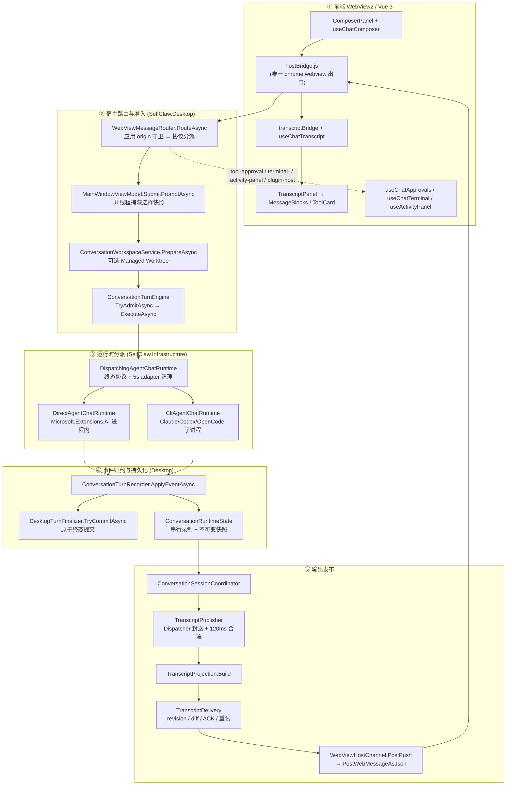
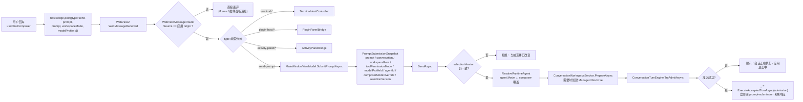
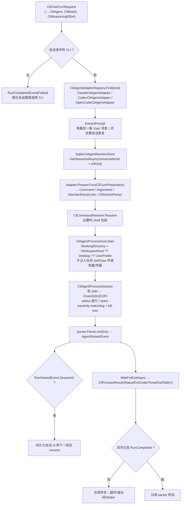
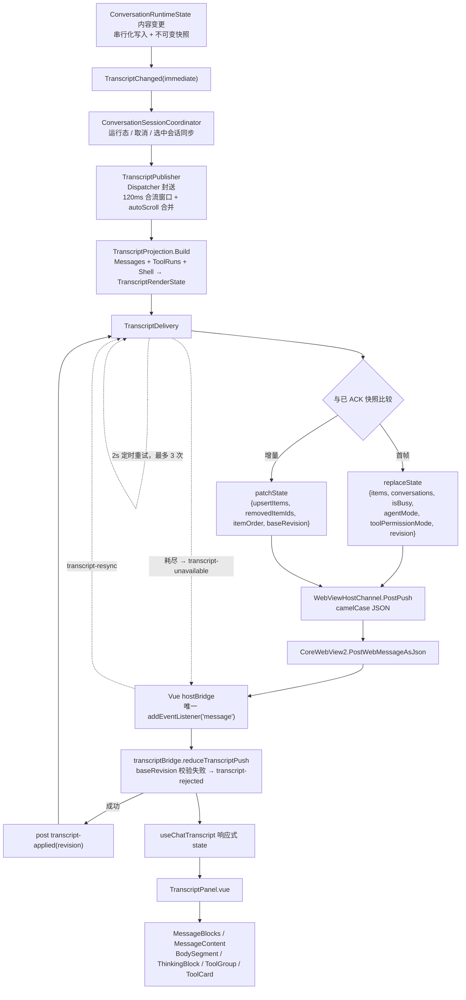
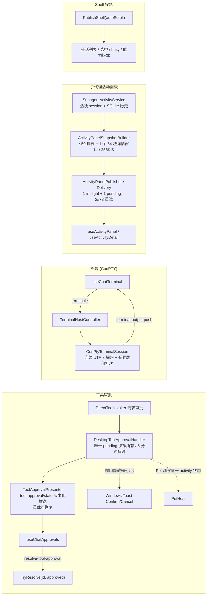
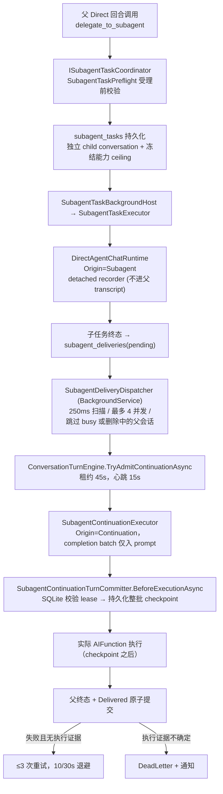

# SelfClaw 全链路架构图：Input → Direct / CLI → Output

更新：2026-09-29。以当前源码为准；逐项证据见文末「证据文件」。运行顺序与契约细节另见 [运行流程与 Direct / CLI 调用链](runtime-execution-flow.md)、[Direct 架构审查](direct-agent-architecture-review.md)、[Desktop 架构整改](desktop-architecture-review.md)。

本文只描述一条交互回合从输入到渲染的端到端主干，以及两条独立执行分支和它们的旁路通道。

## 0. 总览



Direct 与 CLI 是两条完全独立的执行分支，但在 `AgentStreamEvent` 之后共用同一套 recorder、投影和发布管道。CLI 自带认证、模型与工具策略；Direct 走 SelfClaw 的能力快照。

## 1. Input：从 composer 到准入



准入点 `TryAdmitAsync` 的约束：`SemaphoreSlim` 单飞行、`_deletingConversations` 删除墓碑、`_shutdownCancellation` 全局停机；成功后创建/更新会话记录并绑定 `ConversationRuntimeState` 与 `ConversationSessionCoordinator`。

`ExecuteAsync` 的固定顺序：持久化用户消息 → `BuildChatTurnRequestAsync` 按模式产出 `DirectChatTurnRequest` / `CliChatTurnRequest` → 开始 Agent 活动 → `BeginTurn` → 消费事件流 → 终态提交 → `CompleteExecution`。

## 2. Direct 分支：进程内 M.E.AI 全链路

```mermaid
flowchart TB
    START["DirectChatTurnRequest<br/>{TurnId, ConversationId, WorkspaceRoot, Agent,<br/>Messages, ModelProfileId, ToolPermissionMode,<br/>ToolApprovalHandler, ExecutionContext, ToolExecutions}"]

    START --> S1["① 续写守卫<br/>Origin=Continuation 必须有<br/>IToolExecutionCheckpoint，否则抛错"]

    S1 --> S2["② AiChatClientFactory.PrepareAsync(ModelProfileId)<br/>显式 id 或 desktop-default<br/>校验 profile/connection 启用 → 解析 API Format<br/>DPAPI 解密凭据（仅 Infrastructure 内）"]
    S2 --> S3["③ DirectTurnCapabilityResolver.ResolveAsync<br/>用已确定的具体模型 id"]

    subgraph CAP["能力组装（单一 DirectToolBinding 列表）"]
        direction TB
        C1["CreateEffectiveRequest<br/>Continuation 只收缩 ceiling /<br/>Subagent 校验捕获 ceiling"]
        C2["WorkspaceAgentToolset<br/>读/写/编辑/glob/grep/shell"]
        C3["PluginCapabilitySource<br/>版本 + hash + lease"]
        C4["SkillCapabilitySource<br/>Skill token / 运行时工具"]
        C5["McpCapabilitySource<br/>连接池 + revision + 结果 64KiB 上限"]
        C6["SubagentCapabilitySource<br/>delegate/get/cancel/retry"]
        C7["BindTools<br/>名称冲突 + descriptor 对齐 + ToolPolicy 过滤"]
        C8["system instructions<br/>Plugin/Skill/Policy/Degradation"]
        C1 --> C2 --> C3 --> C4 --> C5 --> C6 --> C7 --> C8
    end

    S3 --> CAP
    CAP --> S4["④ DirectTurnHooksFactory.Create<br/>runStarting hooks<br/>→ Blocked 则直接终态"]
    S4 --> S5["⑤ DirectToolInvoker<br/>M.E.AI FunctionInvoker 唯一调用缝"]
    S5 --> S6["⑥ AiChatClientFactory.Create<br/>按回合 HttpClient (共享 pooled handler)<br/>provider adapter → CreateChatOptions/Client<br/>ChatClientBuilder: UseFunctionInvocation(128)<br/>+ UseLogging → AiChatClientLease"]
    S6 --> S7["⑦ RunStartedEvent(direct-{guid}, model)<br/>+ RunStatusEvent(Requesting)"]
    S7 --> S8["⑧ DirectPromptComposer.BuildMessages<br/>System(agent+扩展+policy)<br/>→ History 反向预算裁剪(工具调用/结果不可拆)<br/>→ HookContext → 续写提示 → CompletionBatch"]
    S8 --> S9["⑨ GetStreamingResponseAsync<br/>TurnOutputStream.TranslateUpdate"]
    S9 --> S10["⑩ 终态判定<br/>Length+文本=Truncated / Length 空=Failed<br/>ToolCalls=Failed(循环耗尽) / 其余=Succeeded"]
    S10 --> S11["⑪ runCompleted hook<br/>释放 provider lease → 释放 capability lease"]

    subgraph TOOL["工具调用一次经过的全部关卡"]
        direction TB
        T1["toolExecuting hook<br/>可改参数 / 强制审批 / 阻断"]
        T2["审批判定<br/>RequiresApproval &&!=FullAccess<br/>→ DesktopToolApprovalHandler"]
        T3["ToolExecutionCheckpoint<br/>BeforeExecutionAsync（续写屏障）"]
        T4["AIFunction.InvokeAsync<br/>Workspace / Skill / MCP / Subagent"]
        T5["toolExecuted hook + HookFeedback<br/>→ DirectToolResult(Status/Summary/Content/Detail)"]
        T1 --> T2 --> T3 --> T4 --> T5
    end
    S5 -.-> TOOL
```



要点：

- `DirectToolResult.Detail` 只用于展示，不参与 provider JSON 序列化；MCP 模型结果序列化后硬上限 **65,536 字节**。
- 审批拒绝返回 `Canceled` + 拒绝摘要 → recorder 落库为 `Cancelled`，不抛异常。
- provider pipeline **先于** capability lease 释放，避免 HTTP 流仍在消费时回收 MCP 连接。
- `PrepareAsync` 与 `ResolveAsync` 之间有顺序依赖：能力解析使用已确定的具体模型 id，禁用或无效模型不会先触发 MCP 连接。

## 3. CLI 分支：子进程 JSONL 全链路



解析器：`ClaudeStreamJsonParser`、`CodexJsonEventStreamParser`、`OpenCodeJsonEventStreamParser`（均实现 `CliStreamParser`）。CLI 不消费 Direct 能力快照，也不接受 SelfClaw 的审批与工具策略。

## 4. 事件契约与归约（两条分支在此合流）

```mermaid
flowchart LR
    subgraph RUNTIME["Runtime 侧"]
        D["DirectAgentChatRuntime"]
        C["CliAgentChatRuntime"]
    end
    D --> EV
    C --> EV
    EV["AgentStreamEvent 基类"]

    subgraph TYPES["事件类型"]
        direction TB
        E1["RunStartedEvent"]
        E2["RunStatusEvent"]
        E3["AssistantTextDeltaEvent"]
        E4["AssistantThinkingDeltaEvent"]
        E5["ToolCallStartedEvent / ToolCallCompletedEvent"]
        E6["UsageReportedEvent"]
        E7["RunNoticeEvent"]
        E8["PermissionRequestedEvent / RawOutputEvent"]
        E9["RunCompletedEvent (唯一终态)"]
    end
    EV --> TYPES

    TYPES --> GATE["DispatchingAgentChatRuntime 协议强制<br/>终态只发一次；终态后事件丢弃<br/>5s 内未收尾则取消 adapter"]
    GATE --> REC["ConversationTurnRecorder.ApplyEventAsync<br/>文本/思考增量 → StreamingAssistantContent<br/>工具事件 → ToolExecutionRecord<br/>usage / notice / status / 终态"]
    REC --> TERM["CompleteAssistantTurnAsync<br/>MessageSegment 分块(Text/Thinking/ToolCall 有序)"]
    TERM --> FIN["DesktopTurnFinalizer.TryCommitAsync<br/>ITurnFinalizationRepository<br/>2 次尝试 / 5s 超时"]
    REC --> ACT["AgentActivityCoordinator.ApplyEvent<br/>Pet / 托盘 / Agent 活动态"]
```



终态映射：`Succeeded / Cancelled / Failed / Truncated / Blocked`。异常与用户取消分别走 `FinalizeInterruptedAsync`，保证「流结束但无终态」不会挂起 UI。

## 5. Output：快照 → 差分 → Vue 渲染



可靠性边界：`TranscriptDelivery` 只保留「1 个 in-flight + 1 个 latest pending」；ACK 驱动下一帧；`ReadyChanged`（WebView 导航/重载）触发全量重放；重试 3 次后进入等待恢复，而不是无限刷。

## 6. 旁路通道（与主 transcript 相互独立）



插件面板走同一 origin 守卫之后的 `plugin-host/*`，但每个面板来自独立子域 `https://<plugin-id>.plugin.selfclaw.local`，身份由 `event.origin` + `event.source` 双重匹配得到，payload 里的 `pluginId` 不可信。

## 7. 后台子代理链路（Direct 的函数调用延伸）



关键纪律：`ToolCallStartedEvent` 入队 ≠ 已落库，因此执行屏障是 **checkpoint 的同步提交**，不是事件消费；续写分批发布，父 transcript 只在原子终态时更新一次。checkpoint 只表示「工具可能已开始」，不承诺外部文件、Shell 或 MCP 的 exactly-once。

## 8. 关键所有权与边界速查

| 资源 / 状态 | 所有者 | 边界 |
|---|---|---|
| UI 选择与导航 | `MainWindowViewModel` | 仅 UI 线程；提交时快照 selectionVersion |
| 会话准入 / 删除墓碑 | `ConversationTurnEngine` | 单飞行闸门 + tombstone + 停机取消 |
| Workspace Root / Worktree | `ConversationWorkspaceService` | 准备与释放；提交回合自带捕获值 |
| Direct 能力与 lease | `DirectTurnCapabilityResolver` → `DirectTurnCapabilityLease` | 每回合；`DirectTurnLeaseScope` 统一回收 Plugin/MCP |
| Provider pipeline | `AiChatClientFactory` → `AiChatClientLease` | 每回合 HttpClient；共享 pooled handler 长存 |
| 工具调用唯一缝 | `DirectToolInvoker`（M.E.AI `FunctionInvoker`） | hook → 审批 → checkpoint → 执行 → 反馈 |
| 事件契约与终态 | `DispatchingAgentChatRuntime` | 终态只发一次；终态后事件丢弃 |
| 内容录制与快照 | `ConversationRuntimeState` / `SubagentExecutionSession` | 串行写入；取消后等终态再释放 |
| 持久化终态 | `DesktopTurnFinalizer` | 原子提交，2 次尝试，5s 超时 |
| 输出传输 | `TranscriptPublisher` → `TranscriptDelivery` → `WebViewHostChannel` | 合流 / diff / ACK / 有界恢复；只做传输与 feature 状态 |
| 前端状态 | `transcriptBridge` + `useChatTranscript` | patch 必须匹配 baseRevision，否则请求 resync |

## 9. 验证入口

```powershell
dotnet restore SelfClaw.slnx --force-evaluate
dotnet build SelfClaw.slnx
dotnet test SelfClaw.Tests/SelfClaw.Tests.csproj

cd SelfClaw.TranscriptVue
npm test
npm run test:e2e
```

桌面/进程强杀验证需要 `SELFCLAW_DESKTOP_SMOKE=1`；真实 provider 验证需要 `SELFCLAW_PROVIDER_SMOKE=1`，并启用一个具备推理能力的模型。

## 证据文件

| 层 | 文件 |
|---|---|
| 前端入口 | `SelfClaw.TranscriptVue/src/composables/hostBridge.js`、`useChatComposer.js`、`views/ChatView.vue` |
| 消息路由 | `SelfClaw.Desktop/Services/WebView/WebViewMessageRouter.cs`、`WebViewHostChannel.cs` |
| VM 与准入 | `SelfClaw.Desktop/ViewModels/MainWindowViewModel.cs`、`Services/Workspace/ConversationWorkspaceService.cs` |
| 回合引擎 | `SelfClaw.Desktop/Services/Runtime/ConversationTurnEngine.cs`、`ConversationTurnRecorder.cs`、`DesktopTurnFinalizer.cs`、`ConversationRuntimeState.cs`、`ConversationSessionCoordinator.cs` |
| 分派 | `SelfClaw.Infrastructure/Agents/Runtime/DispatchingAgentChatRuntime.cs`、`Core/Runtime/Requests/ChatTurnRequest.cs` |
| Direct | `SelfClaw.Infrastructure/Agents/Direct/DirectAgentChatRuntime.cs`、`Capabilities/DirectTurnCapabilityResolver.cs`、`Context/DirectPromptComposer.cs`、`Tools/DirectToolInvoker.cs` |
| CLI | `SelfClaw.Infrastructure/Agents/Cli/CliAgentChatRuntime.cs`、`Adapters/`、`Parsers/`、`Process/`、`Session/` |
| Provider | `SelfClaw.Infrastructure/AiProviders/AiChatClientFactory.cs`、`AiProviders/{OpenAi,Anthropic}/` |
| 发布 | `SelfClaw.Desktop/Services/Transcript/{TranscriptPublisher,TranscriptDelivery,TranscriptProjection}.cs`、`SelfClaw.TranscriptVue/src/composables/transcriptBridge.js` |
| 子代理 | `SelfClaw.Desktop/Services/Subagents/{SubagentDeliveryDispatcher,SubagentContinuationExecutor,SubagentTaskExecutor,SubagentContinuationTurnCommitter}.cs`、`SelfClaw.Infrastructure/Agents/Subagents/Runtime/SubagentTaskPreflight.cs` |
