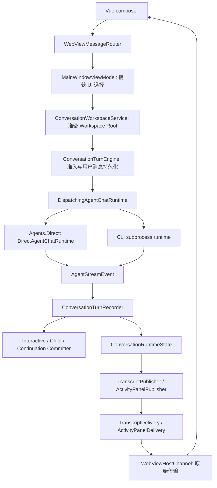

# SelfClaw 运行流程与 Direct / CLI 调用链

更新：2026-09-14。以当前源码为准；逐项证据见 [Direct 架构审查与整改](direct-agent-architecture-review.md) 与 [Desktop 架构整改](desktop-architecture-review.md)。较早的设计文档保留为设计历史。

## 1. 公共回合入口



`WebViewMessageRouter` 先校验应用 origin，再按明确协议分派，并为业务操作返回关联结果。`MainWindowViewModel` 只在 UI 线程更新选择/导航，工作树准备与释放归 `ConversationWorkspaceService`，删除归 `ConversationDeletionService`；`ConversationTurnEngine` 拥有准入、请求组装、事件归约和交互回合收尾。composer 选择的 Direct 模型 id 随 prompt 捕获，空 id 仍由 Direct factory 解析默认模型，Bridge 不再维护另一份 VM 模型缓存。

Direct 和 CLI 使用不同的请求类型与执行方式，继续共享事件、录制器和 transcript 投影。CLI 保留自己的认证、工具策略、模型配置与会话恢复，不消费 SelfClaw 的 Direct 能力快照。

## 2. Direct 模块与准备顺序

| 位置 | 职责 |
| --- | --- |
| `Infrastructure/Agents/Direct/DirectAgentChatRuntime.cs` | 单回合准备、SDK 流消费、事件翻译、usage 与终态纪律 |
| `Agents/Direct/Capabilities` | 能力规则、来源组装、工具冲突与策略过滤、本回合资源 lease |
| `Agents/Direct/Context` | system sections、历史回放、completion batch 与 prompt 预算 |
| `Agents/Direct/Tools` | 工作区 / Skill / MCP 的 SDK 适配、审批与执行 checkpoint、统一结果 |
| `Infrastructure/Extensions` | 包内容、安装检查、内容缓存、Plugin 版本租约、MCP 配置与连接池 |
| `Infrastructure/AiProviders` | provider 协议、凭据、HTTP transport、模型准备与 client 创建 |
| `Infrastructure/Tools/Workspace` | 文件、搜索、Shell I/O 与进程收尾 |

Direct 依赖扩展资源与 provider 服务；Extensions 不引用 Direct 编排、prompt 或工具实现。共享 recorder 留在 Desktop Runtime，继续服务交互 Direct、CLI、child 与 continuation。

一轮 Direct 的顺序是：

1. continuation 请求必须带 `IToolExecutionCheckpoint`。
2. `AiChatClientFactory.PrepareAsync(ModelProfileId)` 确定具体模型。显式 id 与空 id 的 `desktop-default` 都在这里处理；校验档案、连接、协议并解析凭据，得到 `AiProviderClientRequest`。
3. 用确定的模型 id 调用 `DirectTurnCapabilityResolver.ResolveAsync()`。子代理工具捕获的父模型始终具体，禁用或无效模型不会先触发 MCP 连接。
4. `AiChatClientFactory.Create(preparation, pipeline)` 按回合在共享 pooled handler 上构造 `HttpClient`，将工具与 `FunctionInvoker` 交给 provider adapter，创建 options 和带 function invocation / logging 的 SDK 管线。
5. `DirectPromptComposer.BuildMessages()` 构建预算内历史与必需输入。
6. 消费 SDK 流、产生共享事件；先释放 provider pipeline，再释放 capability lease。

Desktop 不再补齐默认模型。排队 child 与 continuation 使用捕获的具体模型 id；模型禁用使准备失败，不会悄悄切换默认模型。reasoning 来自共享模型配置；没有显式配置时保持 provider 默认行为。

## 3. 能力与工具契约

`DirectCapabilityRules` 是 `none/read-only/system`、版本/hash、安装有效性、Plugin/Skill 关系及 MCP revision 判定的共享实现。`SubagentTaskPreflight` 位于 Infrastructure，通过 Core 的 `ISubagentTaskPreflight` 服务受理和执行前两个检查时点。模型单项可用性调用 `IAiModelCatalog.IsModelAvailableAsync(id)`，不构建 enabled-model UI 列表。

| 入口 | 规则失败后的策略 |
| --- | --- |
| Interactive | 使用当前启用且绑定的能力；可选扩展加载失败降级，显式 Skill token 失败仍报错 |
| Subagent | 必须满足捕获的 ceiling，必需能力缺失或变化时失败 |
| Continuation | 只在原 ceiling 内收缩，移除禁用、删除或升级的能力，不扩大权限 |

每个来源返回 `DirectToolBinding`，包含 AIFunction、描述符与审批元数据。最终绑定集中检查名称冲突、过滤策略并安装调用边界；SDK 工具列表与描述符索引从同一批绑定派生。新增工具不再维护中央名称表或修改主循环的 DTO 类型分支。

`DirectToolResult` 携带 `Status`、`Summary`、模型 `Content` 与展示 `Detail`；`Detail` 不参与 provider JSON 序列化。工作区、Skill 与子代理函数使用 SDK `MarshalResult`；MCP 在自己的适配层规范化结果。主循环只解释统一契约和 SDK 异常，未知结果不再默认成功。

审批拒绝返回 `Canceled` 和拒绝摘要，recorder 持久化为 `Cancelled`；实际取消异常沿异步调用传播。`DirectToolInvoker`（M.E.AI `FunctionInvoker`）负责审批与执行准入，MCP 大小限制不再注入审批包装。

## 4. Continuation 恢复与所有权

`SubagentDeliveryDispatcher` 读取 ready mailbox 时排除运行或删除中的父会话。准入竞争或领取失败后继续尝试其他父会话；每批最多检查 32 个候选，失败父会话的跳过集合保留到扫描结束，避免超过一批的失败项持续挡住后续父会话。SQLite 保留父会话 lease 排他性与 mailbox 批次语义。

- dispatcher 从成功准入开始，用 `try/finally` 覆盖领取到移交。未移交时归还已知租约并释放准入；移交后 executor 负责唯一收尾。
- executor 拥有取消、heartbeat 与完成准入。heartbeat 失败停止执行；heartbeat 收尾失败也不能跳过准入释放。
- lease 为 45 秒，heartbeat 为 15 秒；过期恢复在启动时及每 15 秒运行。扫描间隔与 coalescing window 均为 250 ms，最多并发 4 个 continuation。
- 无工具执行证据的失败遵循最多 3 次、10/30 秒退避；不确定的执行进入 DeadLetter。

Schema v27 增加 `subagent_deliveries.tool_execution_started_at_utc`。调用顺序为：

```text
需要时等待审批
  -> SubagentContinuationTurnCommitter.BeforeExecutionAsync()
  -> SQLite 校验当前 lease，持久化整批 checkpoint，等待提交完成
  -> 再次检查取消
  -> 实际 AIFunction 调用
```

这个同步边界独立于事件 Channel。`ToolCallStartedEvent` 入队不等于消费者已落库，不能把事件消费当作执行屏障。

detached recorder 不发布父 transcript，也不写中间工具进度；checkpoint 单独保存恢复证据。父终态与 Delivered/DeadLetter 保留原子事务，completion batch 仍是 prompt-only。过期恢复读取 checkpoint；v26 的既有 leased 行缺乏可信证据，升级时保守标为不确定，不自动重放。

checkpoint 表示“工具可能已经开始”，不提供外部文件、Shell 或 MCP 的 exactly-once。中断可能丢失未提交正文，但不会因缺少 `tool_runs` 而自动重复不确定的操作。租约提交成功但调用方未收到返回值时，由过期恢复收敛。

## 5. 状态与成本边界

| 状态或资源 | 所有者与边界 |
| --- | --- |
| 当前执行内容与取消 | `ConversationRuntimeState` / `SubagentExecutionSession` 串行录制并提供快照，取消后等待终态再释放 |
| 会话加载 | coordinator 的进行中加载表只合并未完成 I/O；成功、失败或取消均移除，调用者只取消自己的等待 |
| 已完成快照 | 只保留当前选中会话；切换后不缓存旧完成会话。运行会话由 runtime state 单独持有 |
| provider pipeline | `AiChatClientLease` 每回合释放按回合 `HttpClient`；共享 pooled handler 继续由 provider 管理 |
| Plugin / MCP lease | `DirectTurnLeaseScope` 统一拥有；来源只释放尚未移交的资源 |
| 历史构建 | 从最近消息向前按需创建 SDK 单元，达到预算边界停止；调用与结果不可拆分 |
| Shell 输出 | 两路增量 drain，各保留前 24,000 个 UTF-16 字符；超额继续排空，超时/取消统一收尾 |
| MCP 模型结果 | 检查完整 `DirectToolResult` 序列化后的 UTF-8 大小，最多 65,536 字节，包含包装、转义及截断提示 |
| Glob | bundled ripgrep，大小写不敏感，匹配 Workspace Root 相对路径；有界 top-K 保留最近 250 项，时间相同按路径排序 |

Glob 保留忽略 `.gitignore` 的路径枚举语义和隐藏文件可见性，排除隐藏目录及已知构建/依赖目录，不跟随目录链接。`relativePath` 只缩小遍历范围，不改变模式的根。

token 预算仍是 UTF-8 大小的启发式估算，不是 provider tokenizer。数据库历史读取、当前会话内容本身及 Skill token 扫描没有变成常量成本。Direct 事件 Channel 仍无界；慢消费者积压与 warm MCP health 写入保留为待测量项。

## 6. 持久化与配置边界

`IConversationRepository` 暴露会话、消息和工具记录。Workspace Root CRUD 归入 `IWorkspaceRootRepository`，与 Git checkout/repository 存储共用 `SqliteWorkspaceRepository`；Git 服务不再依赖会话仓库。provider 管理仓库保持 Infrastructure internal，不机械拆分管理接口。

`StoragePaths` 是五个路径值的纯 record。composition root 通过 `StoragePathDefaults` 计算默认值；DTO 不读取环境。审批、执行 checkpoint 和 preflight 契约位于 Core/Interfaces，描述真实项目边界。

Desktop 配置采用同目录临时文件与原子替换；保存成功后功能服务才更新已确认缓存并发布变更。Agent 定义编辑/绑定在 `AgentSettingsService` 内完成原子读改写，VM 直接订阅并保留会话绑定的 Agent。CLI 发现由独立后台服务执行，不阻塞已确认配置读取；Vue 设置页与 composer 共用选择状态。

Desktop 装配位于 `Composition/DesktopServiceRegistration.cs`。`App` 在真正 Shutdown 前等待窗口/VM 初始化、停止请求与回合准入、取消并等待交互和后台工作、flush Pet 位置、排空 Terminal/Plugin 资源，再释放 DI 服务；初始化等待与关闭各有 20 秒预算，超时明确记录。`OnExit` 不承载异步清理。

Transcript 的 diff/ACK/重放归 `TranscriptDelivery` 与 Vue `transcriptBridge`，最多三次完整重试；通用 Channel 不持有 feature 状态。审批展示归 `ToolApprovalPresenter`，决定归 handler；通知/Pet/托盘通过同一会话激活用例导航。Pet 资源在后台准备为冻结位图，Terminal 使用连续解码与有界尾部，Plugin 资源通过 deferral 异步读取并在读取期间另持 version lease。

## 7. 验证入口

```powershell
$env:DOTNET_CLI_HOME = 'D:\Repositories\SelfClaw\.dotnet'
$env:DOTNET_SKIP_FIRST_TIME_EXPERIENCE = '1'
$env:DOTNET_NOLOGO = '1'
dotnet restore SelfClaw.slnx --force-evaluate
dotnet build SelfClaw.slnx --no-restore -p:BaseOutputPath=bin/direct-refactor-final/
dotnet test SelfClaw.Tests/SelfClaw.Tests.csproj --no-build --no-restore -p:BaseOutputPath=bin/direct-refactor-final/
```

正式回归覆盖真实 AIFunction 封送、四种 provider 协议序列化、执行前 checkpoint、中断恢复、准入异常、多父调度、缓存重试、预算与 glob 边界。Desktop 整改另覆盖 UI 线程、设置原子性、通知导航、CLI 子进程收尾、跨页面选择、消息恢复和资源 lease。桌面/进程强杀 smoke 需要 `SELFCLAW_DESKTOP_SMOKE=1`；真实 provider smoke 需要 `SELFCLAW_PROVIDER_SMOKE=1`。2026-09-14 最终验证为 .NET 821 通过/4 跳过、Vue 32 通过、Edge e2e 11 通过；环境及原生限制见 Desktop review。
